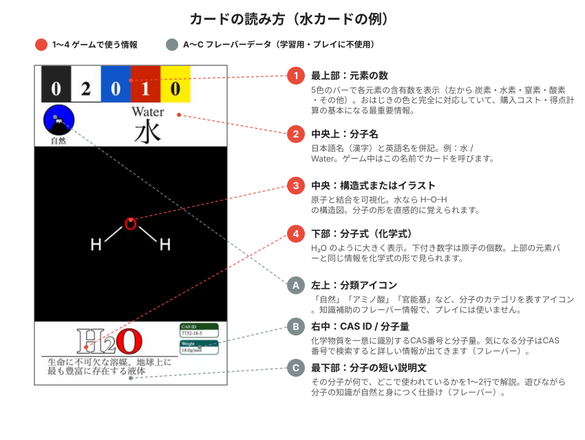

# コンポーネントリスト

**日本語** | [English](./COMPONENTS.en.md)

## 必要コンポーネント一覧

### 1. おはじき（元素駒）

**1セットの内容**:

**ルール文書内では「黒・白」という規範色を使用します。実物のおはじきは黒＝緑、白＝水色で代用。**

| 規範色 | 実物の色 | 対応する元素 | 個数 |
|------|--------|----------|----|
| 黒 | 緑（代用） | 炭素（C） | 10個 |
| 白 | 水色（代用） | 水素（H） | 10個 |
| 赤 | 赤 | 酸素（O） | 10個 |
| 青 | 青 | 窒素（N） | 10個 |
| 黄 | 黄 | その他（Na, Cl, S, F など） | 10個 |

**合計**: 50個（3〜4人プレイは2セット必要）

**サイズ**: 15-18mm

> **なぜ「黒」「白」が「緑」「水色」なのか？**
> 市販のおはじきには黒・白の色がないため、規範表記の「黒・白」に対して実物は「緑・水色」を代用しています。
> ルール文書中はすべて **「黒（炭素）」「白（水素）」** という規範表記を使用します。

> **「その他」とは？**
> 炭素・水素・酸素・窒素以外の元素（ナトリウム、塩素、硫黄、フッ素など）を、ゲームを簡単にするため1つのカテゴリにまとめたものです。
> 化学用語の詳細は [GLOSSARY.md](./GLOSSARY.md) を参照してください。

**おはじきが破損・紛失した場合**:
- **セリア**で「**松野ホビーのおはじき（110円）**」が購入可能
- 色・サイズが本製品に対応しているため、そのまま補充として使用できる

### 2. 元素カード

- **種類**: 5種類（炭素・水素・酸素・窒素・その他）
- **枚数**: 各プレイヤー5枚
- **サイズ**: 名刺サイズ（91×55mm）

### 3. 分子構造カード

分子の複雑さに応じて3レベルに分類。

**カード総数**: Lv1×20、Lv2×20、Lv3×10（合計50枚）

#### カードの読み方

各カードには以下の情報が同じレイアウトで配置されています。実際の水カードを例に図解します。

##### ゲームで使う情報（必須）

| # | 表示位置 | 内容 | 例 |
|---|--------|----|----|
| 1 | 最上部 | **元素の数**（5色のバー） | 左から 炭素・水素・窒素・酸素・その他 の含有数 |
| 2 | 中央上 | **分子名**（日本語・英語） | 水 / Water |
| 3 | 中央 | **構造式または分子のイラスト** | H–O–H など |
| 4 | 下部 | **分子式**（化学式） | H₂O |
| 5 | 右上 | **官能基ポイント（fg pt）** | 0〜6の整数（0の場合は非表示） |

##### フレーバーデータ（学習用・プレイには使わない）

| # | 表示位置 | 内容 | 例 |
|---|--------|----|----|
| A | 左上 | **分類アイコン** | 自然 / アミノ酸 / 官能基 / 人工物 など |
| B | 右中 | **CAS ID / 分子量** | 7732-18-5 / 18.0 g/mol |
| C | 最下部 | **分子の短い説明文** | 「生命に不可欠な溶媒…」など1〜2行の紹介 |

**分子式の読み方の例**:
- `H₂O` = 水素 2個 + 酸素 1個（水）
- `CO₂` = 炭素 1個 + 酸素 2個（二酸化炭素）
- `C₆H₁₂O₆` = 炭素 6個 + 水素 12個 + 酸素 6個（グルコース）

下付き数字は元素の個数。数字がない場合は1個です。
化学用語の詳しい解説は [GLOSSARY.md](./GLOSSARY.md) を参照してください。

#### 官能基ポイント（fg pt）について

分子の「強さ」「複雑さ」を表すゲーム上のスコア。
**MolOhajiki本編** では合計15ptを超えた時点でラウンド終了の合図になります。

- Lv1: ほとんどが 0pt
- Lv2: 1〜4pt
- Lv3: 2〜6pt

---

**分子構造カード全リスト（紛失チェック用）**

#### Lv1カード（20枚）

| | 分子式 | 名前 | 英語名 | fg pt |
|---|--------|------|--------|-------|
| ☐ | H₂ | 水素分子 | Hydrogen | 0 |
| ☐ | N₂ | 窒素分子 | Nitrogen | 0 |
| ☐ | Cl₂ | 塩素分子 | Chlorine | 0 |
| ☐ | O₂ | 酸素分子 | Oxygen | 0 |
| ☐ | -OH | ヒドロキシ基 | Hydroxyl | 0 |
| ☐ | -CHO | アルデヒド基 | Aldehyde | 0 |
| ☐ | CO₂ | 二酸化炭素 | Carbon Dioxide | 0 |
| ☐ | H₂O | 水 | Water | 0 |
| ☐ | H₂S | 硫化水素 | Hydrogen Sulfide | 0 |
| ☐ | -NH₂ | アミノ基 | Amino | 0 |
| ☐ | -CO- | カルボニル基 | Carbonyl | 0 |
| ☐ | -NO₂ | ニトロ基 | Nitro | 0 |
| ☐ | O₃ | オゾン | Ozone | 0 |
| ☐ | SO₂ | 二酸化硫黄 | Sulfur Dioxide | 0 |
| ☐ | C₂H₂ | アセチレン | Acetylene | 0 |
| ☐ | CH₂O | ホルムアルデヒド | Formaldehyde | 1 |
| ☐ | -CH₃ | メチル基 | Methyl | 0 |
| ☐ | -COOH | カルボキシ基 | Carboxyl | 0 |
| ☐ | H₂O₂ | 過酸化水素 | Hydrogen Peroxide | 0 |
| ☐ | NH₃ | アンモニア | Ammonia | 0 |

#### Lv2カード（20枚）

| | 分子式 | 名前 | 英語名 | fg pt |
|---|--------|------|--------|-------|
| ☐ | CH₂O₂ | ギ酸 | Formic Acid | 1 |
| ☐ | CH₄ | メタン | Methane | 0 |
| ☐ | CHCl₃ | クロロホルム | Chloroform | 0 |
| ☐ | HNO₃ | 硝酸 | Nitric Acid | 0 |
| ☐ | C₂H₃Cl | 塩化ビニル | Vinyl Chloride | 0 |
| ☐ | C₂H₄ | エチレン | Ethylene | 0 |
| ☐ | SF₆ | 六フッ化硫黄 | Sulfur Hexafluoride | 0 |
| ☐ | CH₄N₂O | 尿素 | Urea | 3 |
| ☐ | CH₅N₃ | グアニジン | Guanidine | 2 |
| ☐ | C₂H₆O | エタノール | Ethanol | 1 |
| ☐ | C₆H₆ | ベンゼン | Benzene | 0 |
| ☐ | C₃H₆O₃ | 乳酸 | Lactic Acid | 2 |
| ☐ | C₃H₈O₃ | グリセリン | Glycerin | 3 |
| ☐ | C₅H₅N₅ | アデニン | Adenine | 1 |
| ☐ | C₃H₆N₆ | メラミン | Melamine | 3 |
| ☐ | C₄H₆O₄ | コハク酸 | Succinic Acid | 2 |
| ☐ | C₄H₉NO₂ | GABA | GABA | 2 |
| ☐ | C₄H₆O₆ | 酒石酸 | Tartaric Acid | 4 |
| ☐ | C₄H₇NO₄ | アスパラギン酸 | Aspartic Acid | 3 |
| ☐ | C₄H₉NO₃ | トレオニン | Threonine | 4 |

#### Lv3カード（10枚）

| | 分子式 | 名前 | 英語名 | fg pt |
|---|--------|------|--------|-------|
| ☐ | C₆H₈O₆ | ビタミンC | Ascorbic Acid | 4 |
| ☐ | C₇H₅N₃O₆ | TNT | Trinitrotoluene | 4 |
| ☐ | C₆H₈O₇ | クエン酸 | Citric Acid | 4 |
| ☐ | C₁₂H₄Cl₄O₂ | ダイオキシン | Dioxin | 0 |
| ☐ | C₈H₁₁NO₂ | ドーパミン | Dopamine | 3 |
| ☐ | C₈H₁₁NO₃ | ノルアドレナリン | Noradrenaline | 4 |
| ☐ | C₆H₁₂O₆ | グルコース | Glucose | 6 |
| ☐ | C₈H₁₀N₄O₂ | カフェイン | Caffeine | 5 |
| ☐ | C₁₀H₁₂N₂O | セロトニン | Serotonin | 2 |
| ☐ | C₉H₁₃NO₃ | アドレナリン | Adrenaline | 4 |

**サイズ**: 名刺サイズ（91×55mm）、全レベル共通

### 4. その他カード

- **タイトル/QRカード**: 1枚（表: タイトル＋クレジット、裏: QRコード→詳細ルール）
  - MolOhajiki: カード購入権ペナルティのマーカーとして使用
  - MolSolitaire: 発射台2枚の間に挟むスペーサーとして使用
- **プレイヤーカード**: 2枚（おはじきの発射台）

**1セット全カード内訳（63枚）**:

| 種別 | 種類数 | 枚数/セット |
|------|--------|-----------|
| Lv1カード | 20 | 20 |
| Lv2カード | 20 | 20 |
| Lv3カード | 10 | 10 |
| 元素カード | 10（5種×2） | 10 |
| タイトル/QRカード | 1 | 1 |
| プレイヤーカード | 2 | 2 |
| **合計** | **63** | **63** |

### 5. 滑り止めマット（必須）

ラミネート加工されたカードはテーブル上で滑りやすく、弾いたおはじきがカードを動かして判定が乱れます。**全てのゲームで滑り止めマットを敷いてプレイしてください**。特にMolSolitaireでは必須です。

- **ダイソーの滑り止めマット**（110円）が手頃でサイズ調整もしやすく推奨
  - 商品ページ: https://jp.daisonet.com/products/4940921836738
- セリア等の100均でも同種の商品が入手可能

---

## あると便利なもの

**巾着袋**:
- おはじきをランダムに引くために必要（MolOhajiki本編）
- 100均（ダイソー・セリア等）やゲームマーケット会場でも入手可能
- 色や柄はお好みで

