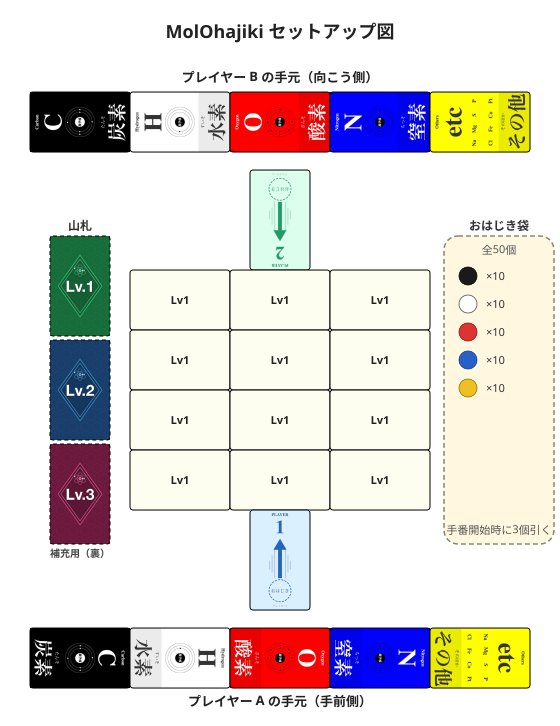

# MolOhajiki（分子構造おはじき）

> 🧪 **シリーズ本編**：おはじきで元素を集め、分子構造カードを買い集めるエンジンビルディング対戦。全員が走り込む 5 つの元素カテゴリで「最多獲得」を争う。

おはじきを弾いて元素を集め、分子構造カードを獲得する教育的デクステリティゲームです。
**炭素・水素・酸素・窒素・その他**の5つの元素カテゴリそれぞれで「最も多く集めた人」を競い、**より多くのカテゴリで1位を取ったプレイヤーが勝利**します。

- **人数:** 2人専用
- **時間:** 30-45分
- **対象:** 10歳以上

> 📘 **おはじきの色とカードの読み方は [COMPONENTS.md](./COMPONENTS.md) を参照**
> 📗 **化学用語（元素・分子式・官能基など）の解説は [GLOSSARY.md](./GLOSSARY.md) を参照**

---

## ゲームの準備

1. **おはじき**（全50個 = 5色×各10個）を袋に入れる
2. **分子構造カード**をLv1・Lv2・Lv3に分けてシャッフルし、それぞれ伏せた山として場の脇に置く
3. **Lv1山から12枚**を引き、**3×4のグリッド**で表向きに並べる（推奨。テーブルが狭ければ最小3×3=9枚に縮小可）
4. 各プレイヤーに **元素カード5枚**（炭素・水素・酸素・窒素・その他）と **発射台カード1枚** を配布
   - 元素カードは自分の手前に5枚横一列に並べる
   - **発射台**はグリッドの自分側の辺に隣接させて置く（元素カードからは少し離す）。狙うカードに合わせて、辺に沿って自由に位置を変えてよい
5. スタートプレイヤーをじゃんけんで決定

> **注意**: プレイヤーは初期おはじきを持たずにゲームを開始します。手番開始時に袋から3個引きます。

下図は2人プレイ時のセットアップ例です（[拡大図](./molohajiki_setup.svg)）。

---

## ゲームの流れ

ゲームはスタートプレイヤーから時計回りに手番を行います。
1手番は **(1) おはじきを弾く → (2) カードを獲得（任意）→ 手番終了処理** の3ステップです。

> 📌 **使い終わりの行き先**：おはじきは**袋**へ戻る／使い終わったカード（分解した／枠から押し出した）は**捨て場**（テーブルの脇）へ送る。捨て場のカードは再利用しません。

### 1. おはじきを弾く

このステップでは「**おはじきを発射 → 着地判定 → 購入権の付与または袋戻し**」を行います。実際の購入処理は次のステップ(2)で行います。

1. 袋から**3個**のおはじきをランダムに引き、全て手元に保持する
   - 袋に3個未満の場合: あるだけ引く（0個なら引かない）

2. 欲しいカードがある場合、発射台カードを**自分側の辺**に沿って動かす（弾く前なら位置変更可。辺をまたいで反対側や横の辺には移動できない）

3. 手元からおはじきを**1個**選んで、欲しいカードに向けて発射台カードから弾く

**手元におはじきが1個もない場合はパス。それ以外は、購入したいカードがなくても必ず1個弾く。**

#### 着地判定

おはじきがカードに少しでも触れていれば「カードに乗った」と判定します。

**複数のカードにまたがった場合（量子力学モデル）**: 物理的に複数のカードに触れている場合、**触れているカードすべてに乗っている**扱いになる（上手い人はあえてまたがるよう狙うこともできる）。どのカードに割り当てるかは事前には決まっておらず、**購入権を確定する瞬間にプレイヤーが1枚を選んで確定**します（=観測で初めて決まる）。1個のおはじき = 1枚分の購入権までしかカウントされません。

着地結果に応じて、以下のいずれかになります。

| 着地結果 | 処理 |
|---------|------|
| カードに乗った（**色不問**） | そのカードの**購入権**を得る → 次ステップ(2)で購入するか判断 |
| 場外に飛び出した／どのカードにも乗らなかった | 弾いたおはじきは**袋に戻す**（購入権なし、手番終了） |

> 💡 1手番で発射するおはじきは1個だけなので、得られる購入権も**最大1枚分**です。

#### 残留おはじき（用語）

カード上に乗っていて、まだ誰にも回収されていないおはじきを **「残留おはじき」** と呼びます。

- 残留おはじきは何個でも積み重なってよい
- 残留おはじきが乗っているカードを誰かが購入した場合 → **全て購入者が獲得**（自分のものも相手のものも含む）

### 2. 分子構造カードの獲得（任意）

**購入は任意です。** この手番(1)で購入権を得たカード（おはじきが乗ったカード）を、**1枚だけ**購入できます。

- **購入しない場合** → 弾いたおはじきはそのままカード上に **残留おはじき** として残ります（手番終了）
- **購入する場合** → 以下の手順で処理します

**獲得の手順**:

1. 購入権のあるカードの分子式を確認する

2. **コスト軽減**（自動）
   - **水素枠なら水素だけ、酸素枠なら酸素だけ**軽減する（配置した枠以外の元素は軽減にも得点にも使われない）
   - 軽減される量は、そのカードに含まれる「配置した枠の元素」の個数分
   - 例: H₂O（H=2, O=1）を**水素枠**に置いていれば → 水素コストを **2軽減**
   - 例: H₂O（H=2, O=1）を**酸素枠**に置いていれば → 酸素コストを **1軽減**
   - 宣言不要。他のプレイヤーに見えるように置いておくだけでOK

3. **支払い**: 軽減後のコストを **手元のおはじき** で支払う（支払ったおはじきは**袋に戻る**）
   - 弾いたばかりのおはじき（カード上）は支払いに使えない
   - カード上の残留おはじきも支払いに使えない（購入後に獲得するため）
   - **支払えない場合** → 購入権は消滅し、弾いたおはじきは **残留おはじき** としてカード上に残る

4. **カード獲得 → 元素枠に配置**: 5つの元素枠のいずれかに新カードを置く（配置・再配置ルールは下記）

5. **おはじき回収**:
   - 弾いたおはじき → 手元に回収
   - カード上の残留おはじき → **全て**手元に獲得

#### カードの配置・再配置

新しいカードを獲得した後、**次の自分の手番開始時まで** カード配置は自由に変更してよい（他人の手番中でも何度でも変更可）。

その上で：
- **5枚制限**: 元素枠は5枠まで。満杯の場合は既存カード1枚を **捨て場** に送ってから新カードを配置する（捨て場のカードは再利用不可）
- **確定タイミング**: 次の自分の手番開始時点で配置を確定。それ以降は次にカードを獲得するまで再配置できない

### 手番終了時の処理

カードの配置・再配置が完了したら、以下を順に処理します。

1. **官能基ポイント終了判定**: 自分の合計が 10pt 以上 → ゲーム終了トリガー（[終了条件](#終了条件)へ）
2. **手元おはじき上限チェック**: 下記の上限を超えていたら超過分を袋に戻す

| 上限の種類 | 上限値 |
|----------|------|
| 手元の合計個数 | **10個まで** |
| 同じ色のおはじき | **5個まで** |

> 手番中の一時的な超過はOK。支払いを終えた時点で上限以下に戻っていれば捨て不要です。

3. **場のカード補充**: 空きマスに山札から表向きで補充（**同レベル優先**、枯渇したら次レベルから）
4. 次のプレイヤーへ手番を回す

---

## ゲームの終了

### 終了条件

**いずれかのプレイヤーが、カードを元素枠に配置・再配置完了後に官能基ポイント合計10以上になった時点で、そのラウンドの終了時にゲームが終了します。**

- 5枚満杯で既存カードを捨て場に送った結果10pt未満になった場合は続行
- **補充山が全て枯渇した後、盤上のカードも全て無くなった場合**もゲーム終了

全員が同じ回数の手番を行った後（1ラウンド）に得点計算を行います。

**例**: 2人プレイでAさん（1番手）が10pt以上に達した場合 → Bさん（2番手）が手番を行ってから得点計算

### 得点計算（マジョリティ方式）

**ステップ1: 各元素の集計**（5カテゴリそれぞれ）
- 元素カード上の対応色のおはじき数
- 元素枠に配置された分子構造カードに含まれる**その枠の元素**の個数

**重要**: カードは配置された元素枠の元素のみカウント。他の枠の元素は無効。
- 例: H₂O（H=2, O=1）を水素枠に配置 → 水素2個分のみカウント

**ステップ2: 各元素のマジョリティ判定**
- 最多所有プレイヤーが「1勝」獲得
- 同数の場合: その元素枠の官能基ポイントが多いプレイヤーが「1勝」
- それでも同数: 全員が「1勝」獲得

**ステップ3: 勝者の決定**

最も多くの元素カテゴリで1位を獲得したプレイヤーが勝者。

**タイブレーカー**（勝利カテゴリ数が同じ場合）:
1. 官能基ポイント（Pt）の総数が多いプレイヤー
2. おはじき引き勝負（袋から1個引き、その色の元素で比較）

**得点計算例**:

| プレイヤー | 炭素 | 水素 | 酸素 | 窒素 | その他 | 勝利カテゴリ |
|----------|------|------|------|------|--------|-------------|
| Aさん    | 8    | 12   | 7    | 2    | 1      | 2（炭素、酸素） |
| Bさん    | 6    | 15   | 5    | 4    | 2      | 3（水素、窒素、その他） |

→ Bさんの勝利

---

## FAQ

### Q: カードに乗れば必ず購入権がもらえますか？
A: はい。おはじきの色に関係なく、カードに少しでも触れていれば購入権を得ます。

### Q: 購入せずにカードに乗せたおはじきはどうなりますか？
A: カード上に残留します。そのカードを購入したプレイヤーが残留おはじきを全て獲得します（自分のものも相手のものも）。

### Q: おはじきの上限はありますか？
A: 2つの上限があります。①手元の合計が10個を超える場合、②同じ色が5個を超える場合、それぞれ超過分を袋に戻してください（チェックは手番最後）。

### Q: 袋のおはじきが足りない時はどうなりますか？
A: あるだけ引きます（0個なら引かない）。欲しいカードがあれば手元から弾けます。手元も0個の場合はパスになります。

### Q: H₂Oを水素枠に配置した場合、酸素としても使えますか？
A: いいえ。水素枠に配置したH₂Oは水素2個分としてのみ使用でき、酸素としては使用できません。配置した枠の元素のみ有効です。

### Q: ゲームはいつ終了しますか？
A: いずれかのプレイヤーが官能基ポイント合計10以上になった時点で、そのラウンドの終了時に終了します。また補充山が全て枯渇した後、盤上のカードも全て無くなった場合もゲーム終了となります。

### Q: 官能基ポイント10以上を獲得したプレイヤーが自動的に勝者ですか？
A: いいえ。ゲーム終了のトリガーになるだけで、勝敗は各元素カテゴリのマジョリティで決まります。5カテゴリ中、より多くで1位を取ったプレイヤーが勝者です。

---

# 上級ルール

## カード分解 ⭐

> 持っているカードを捨てて、より大きな分子を獲得するための補助にする上級ルールです。

**新しい分子構造カードを獲得する時**、既存のカードを**分解**して必要なおはじきを軽減できます。

**軽減と分解の違い**:

| | 軽減 | 分解 |
|--|------|------|
| カードの扱い | 枠に置いたまま | 捨て場に出す |
| 使える元素 | **配置した枠の元素のみ** | **1種類を選んで使う** |
| 使用回数 | 何度でも | 1回限り |
| 例: H₂O（H2 O1） | 水素枠なら水素-2のみ | 水素-2 **か** 酸素-1 どちらか選択 |

- **同じカードで両方は不可**（枠から外した時点で分解のみ）
- 複数カードがある場合、あるカードは軽減・別のカードは分解に使える

**分解の手順**:
1. 「このカードを分解する」と宣言し、元素枠から1枚取り出す（取り消し不可）
2. そのカードに含まれる元素から**1種類を選び**、その個数分だけコスト軽減
   - 例: H₂O → 「水素-2」か「酸素-1」どちらか一方を選ぶ
3. 分解したカードは捨て場に置く（再利用不可）
4. 軽減後のコストをおはじきで支払う（マイナスは0として扱う）

**注意**: 1手番で分解できるカードは1枚まで（標準ルール）

**分解の例**:

獲得したいカード: C₂H₆O（エタノール）通常コスト: C2 H6 O1

| 分解するカード | 選択 | 残りコスト |
|--------------|------|----------|
| H₂O | 水素を選ぶ | C2 H4 O1 |
| H₂O | 酸素を選ぶ | C2 H6（酸素0！） |

**軽減と分解の組み合わせ例**:
- 炭素枠にCO₂を配置 → 軽減（C1軽減、枠に残る）
- 酸素枠にH₂Oを配置 → 分解・酸素を選択（O1軽減、捨て場へ）
- 実質コスト: C1 H6

**重要**: 獲得したばかりのカードをすぐに分解することはできません（1手番で獲得できるカードは1枚のみ）。

### 分解に関するFAQ

**Q: 軽減と分解の違いは？**
A: **軽減**はカードを配置したままコストを減らす（何度でも使える）。**分解**はカードを捨て場に送る1回限りの手段で、含まれる元素から1種類を選んで使える。同じカードで両方は不可。

**Q: カードに乗って購入権を得たら必ず購入しなければなりませんか？**
A: いいえ、購入は任意です。購入しない場合、弾いたおはじきはカード上に残留します。

---

## バリアント一覧

ゲーム開始前に以下の各項目から選択してください。組み合わせは自由です。

### 1. カード分解

| 選択肢 | 説明 | 推奨 |
|-------|------|------|
| なし | 分解メカニクスを使わない | 初心者 |
| **1枚制限** | 1手番で分解は1枚まで | 標準 |
| 無制限 | 複数カードを分解可能 | 上級者・ソロ |

### 2. 使用カード

| 選択肢 | 説明 | 推奨 |
|-------|------|------|
| **全レベル** | Lv1〜Lv3すべて使用（50枚） | 標準（10歳〜） |
| Lv1のみ | お買い物モード（20枚、配置なし） | 7歳〜 |
| なし | おはじきオンリー | 5歳〜 |

### 3. 移動ルール

| 選択肢 | 説明 | 推奨 |
|-------|------|------|
| **固定** | 座ったままプレイ | コタツ・狭いテーブル |
| 自由 | 立って移動してプレイ可能 | 広いテーブル |

### 4. ゲーム終了条件

| 選択肢 | 説明 | 推奨 |
|-------|------|------|
| **10ポイント制** | 官能基ポイント10以上でラウンド終了 | 標準 |
| ターン制 | 固定ターン数で終了 | 時間調整・子供 |

**ターン制の推奨ターン数**: 10ターン/人（想定プレイ時間 30〜40分）

**注意**: 「Lv1のみ使用」とポイント制の組み合わせはゲーム終了不能になる場合があるため使用しないこと（Lv1最高+1pt、5枚上限で最大5pt）。

### 5. 勝利条件

| 選択肢 | 説明 | 推奨 |
|-------|------|------|
| **マジョリティ制** | 5カテゴリ（C/H/O/N/その他）で1位を競う | 標準（10歳〜） |
| 枚数勝負 | カード枚数が多い人の勝ち | 7歳〜 |
| 合計勝負 | おはじき合計が多い人の勝ち | 5歳〜 |

### 6. ゲーム終了ポイント

| 選択肢 | 説明 | 推奨 |
|-------|------|------|
| **10ポイント** | 標準 | 全プレイヤー |
| 12〜15ポイント | 長めにプレイ | 深く戦いたい場合 |

### おすすめ組み合わせ

| 対象 | カード | 分解 | 終了 | 勝利条件 |
|------|---------|------|------|---------|
| **5歳〜** | なし | - | ターン制 | 合計勝負 |
| **7歳〜** | Lv1のみ | なし | ターン制 | 枚数勝負 |
| **10歳〜（初心者）** | 全レベル | なし | 10pt制 | マジョリティ |
| **10歳〜（標準）** | 全レベル | あり | 10pt制 | マジョリティ |

---

## ハンディキャップルール

おはじきが得意な大人と不慣れな子供など、実力差のあるプレイヤーが一緒に遊ぶ場合に使用します。プレイ前に全員で合意してください。

**基本方針: 「強い側を弱くする」方向で設計する。**

### 距離ハンデ
強い側は発射台カードを盤から10〜20cm離した位置に置く（または斜めから弾く）

### 利き手ハンデ（最も使いやすい）
強い側は利き手と逆の手で弾く

### 資源ハンデ
弱い側にゲーム開始時におはじきを5個配布する

### 目隠しハンデ
強い側だけ目を閉じて弾く

### 命中ペナルティ
強い側が狙ったカードに着地できた場合に1点減点（または相手に1点贈与）

### 組み合わせ推奨例

| プレイヤー構成 | 推奨ハンデ |
|--------------|----------|
| 大人 vs 6〜8歳 | 利き手ハンデ + 距離ハンデ |
| 大人 vs 9〜12歳 | 利き手ハンデのみ |
| 経験者 vs 初心者（同年代） | 距離ハンデ または 資源ハンデ |
| パーティ・笑い重視 | 目隠しハンデ |

---

## 分子を学ぼう

ゲームに登場する分子は、私たちの身の回りにあるものばかりです。
各カードの備考欄や、インターネットで調べてみてください。

---

[← ゲーム一覧に戻る](../README.md#ゲーム一覧)
