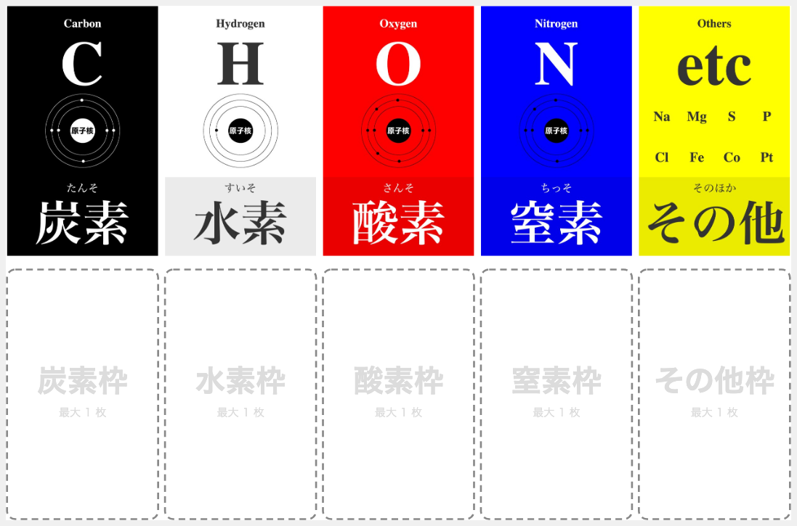

# MolSugo (Molecular Board Game)

[日本語](./molsugo.md) | **English**

> 🎲 **Chemistry in a loop:** Travel a molecular track, collect elements as resources, and build your engine. When someone crosses the finish line, everyone reveals their cards in a single showdown — the player who wins the most of the five element categories takes the game.

A dexterity-free, track-based engine-building game. Players race around a circular loop of molecule cards, managing resources and buying cards to strengthen their collection. At the end, a **simultaneous reveal showdown** determines who wins each of the five element categories (Carbon · Hydrogen · Oxygen · Nitrogen · Other). **The player who wins the most categories wins.** fg pt (functional group points) meet or exceed 15 triggers the end of the game — they are not victory points.

- **Players:** 3–6 (4 recommended)
- **Time:** 30–60 min
- **Age:** 10+

> 📘 **Marble colors and how to read a card → [COMPONENTS.en.md](./COMPONENTS.en.md)**
> 📗 **Chemistry terms → [GLOSSARY.en.md](./GLOSSARY.en.md)**

---

## Components

- Molecule cards (Lv1 × 20, Lv2 × 20, Lv3 × 10)
- Element cards × 10 (5 types × 2 sets — **used as loop spaces**)
- Title card × 1 (Start space)
- **5-color dice × (number of players)** (black · white · red · blue · yellow = Carbon · Hydrogen · Oxygen · Nitrogen · Other resource counters)
- **White dice × 2** (movement)
- **Dice tray × 1** (to keep the circular loop from being disturbed; a small dish works)
- **Player markers × (number of players)** (marbles, meeples, etc.)
- **Player mats × (number of players)** (print from GitHub at A4 landscape; has 5-color dice zone + 5 element slots) — [SVG](./molsugo_playerboard.svg)

> 💡 Cards that overflow from element slots sit physically beside or in front of the mat (no dedicated area needed).

> 💡 **Sourcing dice:** Daiso's "4-color dice set" + "white dice set" covers everything (use green as a stand-in for black).

> 💡 **Telling the white dice apart:** Resource-white (Hydrogen) dice and movement-white dice are the same color, so keep movement dice on the tray or otherwise physically separate them.

---

## Setup

1. **Set the Title card aside. Divide the remaining 60 cards (50 molecule cards + 10 element cards) into three groups and shuffle each group:**
   - Group A: **20 Lv1 cards**
   - Group B: **20 Lv2 cards**
   - Group C: **10 Lv3 cards + 10 element cards mixed together (20 cards)**

2. **Assemble the draw pile** (top to bottom):
   ```
   [top]    Title card (1)
            Group A — Lv1 (20)
            Group B — Lv2 (20)
   [bottom] Group C — Lv3 + Element (20)
   ```

3. **Deal from the top of the pile one card at a time, arranging them in a circle on the table:**
   - The first card (Title card) is the **Start space**
   - Each subsequent card is placed clockwise, adjacent to the previous one
   - **Overlap cards slightly so that only about 1 cm of the top edge is visible** — the molecular formula printed there is enough to identify the space, and this keeps the loop compact
   - Once all 61 cards (Title + 60) are placed, the circle closes
   - All cards are **face-up and visible to everyone at all times — there are no hidden cards**

   ```
   Clockwise order:
       Title → Lv1 × 20 → Lv2 × 20 → Lv3 + Element × 20 → (back to Title)
   ```

4. **Give each player one player mat and one set of 5-color dice.**
   - Set all dice to **6** (starting resources = 6 of each element)

5. Place the **2 white movement dice** near the center of the table

6. **All players place their marker on the Title card**

7. **Determine the starting player by rock-paper-scissors. Play proceeds clockwise.**

The setup diagram below shows the finished arrangement ([larger view](./molsugo_setup.svg)). Color key: 🟩 Lv1 / 🟨 Lv2 / 🟧 Lv3 / 🟦 Element card.


Print the player mat yourself at A4 landscape ([SVG](./molsugo_playerboard.svg)).



> ▶ Ready to play. In a hurry? Jump straight to [Turn flow](#turn-flow) — refer back to terms as needed.

---

## Terminology

**Resource dice:**
> Each player's set of 5-color dice. The face showing (1–6) is their current count of that element. **Maximum: 6** (going above 6 does nothing — resources do not overflow).

**Movement dice:**
> Two shared white dice on the table. **The active player** rolls them at the start of their turn; the sum (2–12) is how many spaces they advance.

**Round:**
> One full lap where every player takes one turn, starting with the starting player (the dealer).

**Space:**
> Each card in the circular loop. Players land on a space and either buy its card or recover resources. The Title card is also a space. **All cards are always face-up and visible — nothing is hidden.**

**Loop restructure:**
> When a molecule card is purchased, remove it and **close the gap by sliding all subsequent cards forward**. There are never empty spaces in the loop. Element cards stay on the loop permanently and are never removed.

**Element slots (deck):**
> The five color lanes on a player's mat (black · white · red · blue · yellow). **Each slot holds at most 1 molecule card** — a player's deck is always at most 5 cards.

**Hand cards:**
> Molecule cards owned but not placed in an element slot (i.e., overflow). **They provide no reduction bonus** during the game, but in the end-game showdown they count alongside slot cards toward majority.

**Reduction:**
> The count of an element in a card placed in that element's slot. Example: Methane CH₄ in the Hydrogen slot → **Hydrogen reduction = 4**. One card per slot only — reductions do not stack.

**fg pt (functional group points):**
> The point value printed on each molecule card. Used for the end-game trigger (15 or more) and as a tiebreaker. See [GLOSSARY.en.md](./GLOSSARY.en.md) for details.

**Dealer:**
> The starting player chosen at the beginning of the game. When the end condition triggers, the round completes until the player **just before the dealer** has taken their turn.

---

## Turn flow

```
1. The active player rolls the 2 movement dice
2. Advance that many spaces clockwise
3. Act based on the type of space landed on:
   - Molecule card → buy it OR recover resources (your choice)
     ※ If you cannot afford it, or choose not to buy, you recover resources and end your turn
   - Element card  → restore that element to 6 (card stays on the loop)
   - Title card    → all elements +1 (max 6)
4. If the Title card was PASSED (not landed on) during movement → all elements +1 (max 6)
   > Passed = the Title space was in the movement path but you did not stop there.
5. Pass to the next player
```

---

## Resource management (core mechanic)

**5-color dice = resource counters.**

- Starting value: 6 · 6 · 6 · 6 · 6 (6 of each element)
- **Maximum: 6** (an element already at 6 cannot be recovered further)
- **Minimum: 0** (cannot purchase if insufficient resources)
- **Representing 0:** Because dice faces only go from 1 to 6, a resource of 0 is shown by **removing that die from the player mat** (absent = 0). When that element is recovered, set the die to 1 and place it back on the mat.

### Recovering resources (not buying)

When landing on a molecule card and choosing **not to buy**:
- Restore **1 of each element type** shown in the formula (subscripts are ignored)
- Example: landing on Ethanol **C₂H₆O** → black +1, white +1, red +1 (each up to 6)

### Landing on an element card space

- **Restore that element's die to 6**
- The element card **stays on the loop** (it can be used repeatedly, by anyone)

### Title card (Start space)

- **Landing:** all element dice +1 (max 6)
- **Passing:** all element dice +1 (max 6)
- Landing and passing are handled separately. If you land on the title card, you do **not** also receive the passing bonus — it is one or the other, not both.
- **Cannot be purchased**

---

## Buying cards

**You may only buy a card when you land on it.**

### Calculating the cost

```
Required     = count of that element in the card's molecular formula
Amount paid  = Required − (reduction from the card in that element's slot)
               (floored at 0 — over-reduction gives no refund)
```

A card can be purchased if  **amount paid ≤ current die face**  for every element.

### Payment process

1. For each element, **reduce that die by the amount paid**
2. **Place the purchased card in one of your 5 element slots** (any slot of your choice; reduction only applies for the slot's matching element)
3. If a card already occupies the chosen slot, that card **moves to your hand**
4. At this moment you may also **swap hand cards ↔ element slots** freely (take a hand card into a slot, push out the slot card to your hand — **only during the turn you buy a card; no limit on swaps**)

### Example: buying H₂O (Hydrogen × 2, Oxygen × 1)

- Required: Hydrogen 2, Oxygen 1
- Payment: white die −2, red die −1
- Placement: H₂O goes in **either the Hydrogen slot or the Oxygen slot** (player chooses)

### Example: buying Ethane C₂H₆ with a reduction active

**Assume H₂O was previously placed in the Hydrogen slot.**

- Required: Carbon 2, Hydrogen 6
- Reduction: Hydrogen slot holds H₂O (reduction = 2); no card in Carbon slot
- Amount paid: Carbon 2, Hydrogen 6 − 2 = 4
- Payment: black die −2, white die −4

### Loop restructure after purchase

- Remove the purchased card from the loop; stack it on the matching element slot of your mat
- **Slide all subsequent cards forward to close the gap** (no empty spaces)
- Any player markers sitting on the removed card (the buyer's marker and any co-occupants) move to the **card immediately before the purchased card** (one step back in the clockwise direction). Markers on all other cards do not move.

---

## End of game

**When any player's total fg pt across all their cards (element slots + hand) reaches 15 or more, that player announces the end immediately upon purchasing the triggering card.**

- The current round continues until the player **just before the dealer** has taken their turn
- **If the dealer triggers the end,** all remaining players each take one more turn before scoring
- Once everyone has had the same number of turns, proceed to the showdown

> If the card loop runs out of molecule cards, the round also ends after everyone finishes.

---

## Majority showdown (simultaneous reveal)

After the game ends, players compete category by category across the five elements in the fixed order **Carbon → Hydrogen → Nitrogen → Oxygen → Other**. Cards used in one category **cannot be used in another**, so deciding where to commit each card is crucial.

> **Each player's collection = all cards accumulated during the game: element slots (up to 5 cards) + hand cards.** Cards played in one category are discarded and cannot be used in any subsequent category.

### Procedure

1. Resolve categories in order: **Carbon → Hydrogen → Nitrogen → Oxygen → Other**
2. Each player **selects 1 card from their collection (element slots + hand cards) and places it face-down** (players may also choose not to submit a card — they cannot win that category, but they preserve the card for later)
3. When everyone is ready, **flip all cards simultaneously on a shared call**
   > Use whatever call your table likes — "Ready, go!", "3-2-1-flip!", "いっせいのせい", "Fight!" — anything works.
4. The player whose card contains the **most of that category's element** wins the category → **+1 majority point**
5. Ties are broken by **the card's fg pt**; if still tied, it is a **draw (no one scores)**
6. Set used cards aside (removed from the game), then move to the next category

### Final tiebreaker

After all five categories, if players are tied on majority points, the player whose set-aside cards have the **higher total fg pt** wins.

---

## Variant

- **Multiple-card reveal:** Change the rule so players may submit any number of cards to one category. Compare the total element count; ties broken by total fg pt of submitted cards. (Recommended for experienced players.)

---

## House rules welcome

Feel free to change anything. Share your ideas on X with `#MolOhajiki`.

---

**Practice problems:** [Tsumebunshi problem set](../puzzles/tsumebunshi.md) (50 problems · element slot placement)

[← Back to game list](../README.en.md#the-seven-games)
