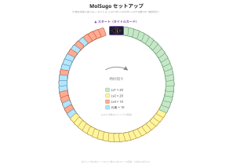

# MolSugo（分子双六）

**日本語** | [English](./molsugo.en.md)

> 🎲 **カードで作る化学スゴロク**：分子マスを巡って元素を集め、リソースを管理しながらカードを買い集める。最後は「いっせいのせい」で5元素のマジョリティを競うエンジンビルドゲーム。

デクステリティ不要の双六型エンジンビルディング対戦です。**炭素・水素・酸素・窒素・その他**の5カテゴリで「いっせいのせい」によるマジョリティ争いを行い、**より多くのカテゴリで1位を取ったプレイヤーが勝利**します。fg pt（官能基ポイント）合計15以上はゲーム終了のトリガーであり、勝利点ではありません。

- **人数:** 2〜6人（4人推奨）
- **時間:** 30〜60分
- **対象:** 10歳以上

> 📘 **おはじきの色とカードの読み方は [COMPONENTS.md](./COMPONENTS.md) を参照**
> 📗 **化学用語（元素・分子式・官能基など）の解説は [GLOSSARY.md](./GLOSSARY.md) を参照**

---

## コンポーネント

- 分子構造カード（Lv1: 20枚、Lv2: 20枚、Lv3: 10枚）
- 元素カード 10枚（5種 × 2セット、**ループのマスとして使用**）
- タイトルカード 1枚（スタートマス）
- **5色サイコロ × プレイヤー人数**（黒・白・赤・青・黄 = 炭素・水素・酸素・窒素・その他のリソースカウンター）
- **白サイコロ 2個**（移動用）
- **サイコロトレイ 1個**（円形配置を乱さないため。小皿等で代用可）
- **プレイヤーマーカー × プレイヤー人数**（おはじきやミープル等）
- **プレイヤーマット × プレイヤー人数**（GitHubで配布・各自A4ランドスケープで印刷。5色サイコロ置き場 + 元素枠5列）— [PDF](./molsugo_playerboard.pdf) / [SVG](./molsugo_playerboard.svg)

> 💡 手元のカード（元素枠からあふれた分）は物理的にマットの脇・手前に置く（専用エリアは不要）。

> 💡 **サイコロ調達**: ダイソーの「4色サイコロセット」+「白サイコロセット」で揃う（緑を黒の代用として使用）。

> 💡 **白サイコロの区別**: リソース用の白（水素）サイコロと移動用の白サイコロは同色のため、サイコロトレイ上に移動用を置くなど物理的に区別しておく。

---

## セットアップ

1. **タイトルカード1枚を脇に取り置く。残り60枚（分子構造カード50枚 + 元素カード10枚）を3グループに分けて、それぞれシャッフル**する
   - グループA: **Lv1カード 20枚**
   - グループB: **Lv2カード 20枚**
   - グループC: **Lv3カード 10枚 + 元素カード 10枚を混ぜて20枚**

2. **山札を作る**（上から下へ）：
   ```
   [一番上]  タイトルカード（1枚）
              Lv1グループ（20枚）
              Lv2グループ（20枚）
   [一番下]  Lv3+元素グループ（20枚）
   ```

3. **山札の上から1枚ずつ取り、円を描くようにテーブルに並べる**
   - 最初の1枚（タイトルカード）を**スタート位置**に置く
   - 2枚目以降は時計回りに隣接させて並べる
   - **カードの上端1cmほどだけが見える程度に少しずつ重ねて並べる**と省スペースで円が作れる（上端には分子式が書かれているのでマスとして機能する）
   - 全61枚（タイトル + 60枚）を並べ終わると円が閉じる
   - すべてのカードは**表向き・全員から見える状態**にする（隠れているカードはない）

   ```
   時計回りの配置順:
       タイトル → Lv1×20 → Lv2×20 → Lv3+元素×20 → （タイトルに戻る）
   ```

4. **各プレイヤーにプレイヤーマット1枚と5色サイコロ1セットを配布**
   - サイコロを全て**6の目**を上にしてマット上に並べる（初期リソース = 各元素6個）

5. **白サイコロ2個（移動用）**を場の中央付近に置く

6. **全プレイヤーは自分のマーカーをタイトルカード上に置く**

7. **スタートプレイヤーをじゃんけんで決定。以降は時計回りに手番が進む**

下図はセットアップ完成イメージです（[拡大図](./molsugo_setup.svg)）。色の意味: 🟩Lv1 / 🟨Lv2 / 🟧Lv3 / 🟦元素カード。



> ▶ 準備完了。急ぐ場合は「[1手番の流れ](#1手番の流れ)」へ（用語は後から参照可）。

---

## 基本用語

**リソースサイコロ:**
> 各プレイヤーが持つ5色のサイコロ。それぞれの目（1〜6）が、その元素の現在の保有数を表す。**最大6**（6を超えても増えない）。

**移動サイコロ:**
> 場に共通の白サイコロ2個。**手番プレイヤーが**手番開始時に2個振り、合計値（2〜12）が進むマス数。

**ラウンド:**
> スタートプレイヤー（親）から始まり、全員が1回ずつ手番を行う1周のこと。

**マス:**
> 円形ループの各カード。プレイヤーは止まったマスのカードを購入したり、リソースを回復したりする。タイトルカードもマスの一つ。**すべてのカードは表向き・常時可視**で、隠れているカードはない。

**ループ再構成:**
> 分子構造カードが購入されると、そのカードを取り除き、**後ろのカードを前に詰めて円を再構成**する。空きマスは発生しない。元素カードは盤に残り、消費されない。

**元素枠（デッキ）:**
> プレイヤーマット上の5つの色レーン（黒・白・赤・青・黄）。**各枠に最大1枚**の分子構造カードを置ける（=デッキは常時最大5枚）。

**手元のカード:**
> 元素枠に入れていない（=入りきらない）分子構造カード。**軽減効果は発動しない**が、ゲーム終了時のマジョリティ判定では元素枠のカードと統合して使える。

**軽減:**
> 元素枠に置いたカードに含まれる、その枠の元素の個数。例：水素枠にメタン CH₄ → **水素軽減=4**。各枠1枚のみ・累積なし。

**fg pt（官能基ポイント）:**
> 各分子構造カードに記載された得点数値。ゲーム終了条件（合計15以上）と同数タイブレークに使用する。詳細は [GLOSSARY.md](./GLOSSARY.md) を参照。

**親:**
> ゲーム開始時に決めたスタートプレイヤー（最初に手番を行った人）。終了条件が発動したラウンドでは、**親の1つ手前のプレイヤー**まで全員が手番を行ってからマジョリティ判定に入る。

---

## 1手番の流れ

```
1. 手番プレイヤーが移動サイコロ2個を振る
2. 出目の合計マス進める（時計回り）
3. 止まったマスのカード種類に応じて処理：
   - 分子構造カード → 購入する OR リソース回復する（どちらか選択）
     ※リソース不足で購入できない場合、またはリソースが満タンの場合も、回復扱いで手番を終える
   - 元素カード     → 該当元素を6まで回復（カードは盤に残す）
   - タイトルカード → 全元素リソース+1（最大6）
4. 移動中にタイトルカードを**通過**した場合 → 全元素リソース+1（最大6）
   > **通過** = 移動経路にタイトルマスが含まれたが、止まらなかった場合。
5. 次のプレイヤーへ
```

---

## リソース管理（コアメカニクス）

**5色サイコロ = リソースカウンター。**

- 初期値: 6・6・6・6・6（各元素6個ずつ持っている状態）
- **最大値: 6**（既に6の元素は回復しても変化なし。オーバーフローしない）
- **最小値: 0**（リソース不足で支払い不可なら購入できない）

### リソース回復（買わない場合）

分子構造カードに止まり、**購入しない**ことを選んだ場合：
- そのカードに含まれる**各元素タイプを1個ずつ回復**（添字は無視）
- 例：エタノール **C₂H₆O** に止まる → 黒・白・赤のサイコロをそれぞれ +1（最大6）

### 元素カードマスに止まった場合

- **該当元素のサイコロを 6 まで回復**
- 元素カードは**盤に残す**（何度でも誰でも利用可、消費されない）

### タイトルカード（スタートマス）

- **着地・通過いずれも**: 全元素リソース +1（最大6）
- **購入不可**

---

## カードの購入

**着地時のみ購入可能**。

### 必要量の計算

```
そのカードを買うための必要量 = カードの分子式に含まれる、その元素の個数
支払う量                    = 必要量 − その元素枠に積んだカードの軽減
                              （0未満なら0：軽減過剰でも返金はない）
```

各元素について **支払う量 ≤ 現在のサイコロの目** ならカードを買える。

### 支払い処理

1. 各元素について、**支払う量だけサイコロの目を減らす**
2. 購入したカードを**元素枠（5枠）のうち1つに配置**する（どの枠にでも自由に配置できる。軽減はその枠の元素カテゴリについてのみ発動）
3. 配置先の枠に既存カードがあれば、**そのカードは「手元のカード」に移動**して保管される
4. このタイミングで**手元のカード ⇔ 元素枠 のスワップ**も可能（手元から1枚を元素枠に入れ、押し出された枠のカードを手元へ。**購入した手番のみ有効・回数制限なし**）

### 例：H₂O（水素×2、酸素×1）を買う

- 必要量: 水素 2、酸素 1
- 支払い: 水素サイコロ −2、酸素サイコロ −1
- 配置: H₂O を**水素枠か酸素枠のいずれか**に重ねる（プレイヤーが選択）

### 例：エタン C₂H₆ を買う（軽減が効いた場合）

**※前の購入で H₂O を水素枠に配置していたとする。**

- 必要量: 炭素 2、水素 6
- 軽減: 水素枠に H₂O 1枚（軽減=2）、炭素枠に何もなし
- 支払う量: 炭素 2、水素 6−2 = 4
- 支払い: 炭素サイコロ −2、水素サイコロ −4

### 購入後のループ処理

- 購入したカードを盤から取り除き、プレイヤーマットの元素枠に重ねる
- **後ろのカードを前に詰めて円を再構成**（隙間ができないように）
- 購入されたカードの上にいたプレイヤー全員のマーカーは、詰まってきた**次のカード**の位置に移動する。それ以外のカードにいるプレイヤーのマーカーは動かない。

---

## ゲーム終了

**いずれかのプレイヤーの保有カード（元素枠＋手元）の fg pt 合計が 15 以上になったら、そのカードを購入した時点で達成者本人が「終了宣言」を行う**。

- 達成者を含むそのラウンドを完走（**親の1つ手前のプレイヤー**まで全員が手番を行う）
- **達成者が親本人の場合**は、残りの全プレイヤーが手番を行ってから終了する
- 全員の手番数が揃ったところで終了処理に入る

> 万が一カードが尽きた場合もそのラウンド完走で終了。

---

## マジョリティ判定（いっせいのせい）

ゲーム終了後、5つの元素カテゴリ（炭素・水素・酸素・窒素・その他）について順番に勝負を行います。各カテゴリで使用したカードは**使い切り**（以降のカテゴリには使えない）ため、どのカテゴリに何を出すかの配分が重要です。

### 手順

1. **カテゴリを1つ選ぶ**（炭素から順番で良い）
2. 各プレイヤーは**保有するカード（元素枠5枚 + 手元のカード）から1枚を選んで伏せて出す**（参加しない場合は出さなくてよい）
3. 全員が選び終わったら **「いっせいのせい」で同時に表向き**
4. **そのカテゴリの元素を最も多く含むカード**を出した人がカテゴリ勝利 → **マジョリティポイント 1点獲得**
5. 同数の場合は**カードの fg pt が高い方**が勝利、それも同じなら**ドロー（誰も得点しない）**
6. 使ったカードは脇にどけ（ゲームから除外・戻らない）、次のカテゴリへ進む

### 最終タイブレーク

全カテゴリ終了後、マジョリティポイント同数の場合は、**判定で使用したカード（脇にどけたカード）の fg pt 総和が大きい人**が勝ち。

---

## バリアント

- **「いっせいのせい」で複数枚出し可**: 1つの元素カテゴリに何枚でも出せるルールに変更。合計の元素数で勝負し、同数の場合は出したカードの fg pt 合計が高い方が勝利。（上級者向け）

---

## ハウスルール歓迎

どこを変えても自由です。アイデアはXで `#MolOhajiki` を付けて教えてください。

---

[← ゲーム一覧に戻る](../README.md#ゲーム一覧)
