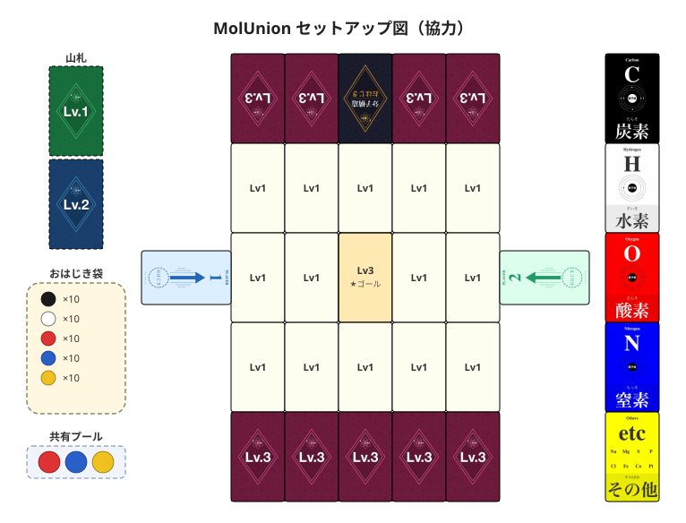

# MolUnion (Molecular Alliance)

[日本語](./molunion.md) | **English**

> 🤝 **Cooperative engine-build: everyone works toward a single Lv3 molecule.** Pick from the shared pool, flick, stack reductions — and capture the goal card together.

- **Players:** 2–5 (4 recommended)
- **Time:** 30–45 min
- **Age:** 10+

> 🎴 **Core rules follow [MolSolitaire](./solitaire.en.md):** card capture, decomposition, and slot reductions are inherited from the solitaire game. MolUnion extends these into a cooperative experience where everyone shares one set of element slots (off-board marbles go back to the bag; one marble chosen from the shared pool per turn — details below).
> 📘 **Marble colors and how to read a card → [COMPONENTS.en.md](./COMPONENTS.en.md)**
> 📗 **Chemistry terms → [GLOSSARY.en.md](./GLOSSARY.en.md)**

---

## Components

- Molecule cards (Lv1 × 20, Lv2 × 20, Lv3 × 10)
- Element cards × 5 (one set of 5 types)
- Title card × 1
- Marbles: 5 colors × 10 each (50 total)
- Launcher cards × 2
- Shared pool tray (small dish or a surface with a slight recess — players supply their own)
- Non-slip mat × 1 (**required** for play)

---

## Setup

Place everything as shown below ([larger view](./molunion_setup.svg)).



1. Lay the **non-slip mat** in the play area
2. Draw **1 random Lv3 card** and place it face-up in the **center cell (column 3, row 2) of a 5×3 grid**. This is the **Goal Card**
3. **Shuffle the 20 Lv1 cards** and place 14 of them face-up in landscape orientation to fill the remaining 14 grid cells. The remaining 6 become the **Lv1 draw pile** beside the board

   > The border around the grid (Lv3 face-down rows top/bottom, title card, launcher cards left/right) serves as the **raised surface from which players flick marbles**. See steps 4–6.

   ```
          [Lv3↓  Lv3↓  Title  Lv3↓  Lv3↓]   ← top players' flicking edge
          ┌──┬──┬──┬──┬──┐
          │L1│L1│L1│L1│L1│
          ├──┼──┼──┼──┼──┤
   [Lnch1]│L1│L1│🎯│L1│L1│[Lnch2]
          ├──┼──┼──┼──┼──┤
          │L1│L1│L1│L1│L1│
          └──┴──┴──┴──┴──┘
          [Lv3↓  Lv3↓  Lv3↓  Lv3↓  Lv3↓]    ← bottom players' flicking edge
   ```

4. Take the **remaining 9 Lv3 cards** (10 total − 1 goal) and turn them face-down. Place 4 of them along the **top edge** of the grid with the **Title card** centered among them. Orient the title card so text faces the top players (rotated 180°). This row acts as a **flat raised surface** for flicking
5. Place the **remaining 5 face-down Lv3 cards** along the **bottom edge** of the grid (flicking surface for bottom players). All 10 Lv3 cards are now in use (center 1 + top 4 + bottom 5)
6. Place the **2 launcher cards** along the left and right edges of the grid, rotated 90° to face the center. Left/right players flick from here
7. Arrange the **5 element cards** vertically beside the board. This is the **shared element rack** — captured molecule cards are stacked here to build everyone's reductions
8. Shuffle the **20 Lv2 cards** and place them as the **Lv2 draw pile** beside the board
9. Put all **50 marbles** in the bag
10. Place the **shared pool tray** beside the board and draw 3 random marbles from the bag into it
11. Players sit around the board and determine the first player

---

## Terminology

**Shared pool:**
> Three marbles always sitting in the central tray — everyone's "draw source." Each turn one is taken out, and one new marble is drawn from the bag to restore it to 3.

**Shared element rack:**
> Five element cards used by everyone. Captured molecule cards are stacked here, and the reduction bonus applies to **every player's** capture check every turn.

**Shared stock:**
> A side area for cards captured but not yet placed in the element rack, and for cards that have been swapped out of the rack. Any player can decompose cards from here on their turn.

**Round:**
> The interval between one card purchase and the next. The player who purchases a card becomes the new **round starter**; the count resets. At the very start of the game, the first player is the round starter.

**On the board / off the board:**
> When a marble comes to rest: **not touching the mat = on the board**; **touching the mat = off the board** (check by looking from the side). Off-board marbles go **back into the bag** (unlike MolSolitaire, they are not consumed).

**Straddling marbles (quantum mechanics model):**
> A marble touching multiple cards counts as being on all of them. At the moment a player decides to capture a specific card, they assign the straddler to that card — it locks in at capture time.
>
> **Special case:** If a marble straddles a spacer (face-down Lv3) and a capture-target card, it counts as being on the capture-target card only (spacer contact is ignored).

---

## Turn flow

```
1. Choose 1 marble from the shared pool and flick it

2. Draw 1 marble from the bag to restore the pool to 3

3. Perform the capture check
   - You may decompose a card before checking
   - Capture any qualifying cards
   - Discuss with everyone where to place captured cards in the shared element rack

4. Refill empty grid cells from Lv1 or Lv2 (decide together)

5. Pass to the next player
```

---

## Miss condition (cooperative tension)

**If no card is purchased within 4 turns of the round starter, the group takes 1 miss.**

- The 4-turn window is fixed regardless of player count (roughly 1–2 laps around the table)
- The player who purchases a card becomes the **new round starter** and the count resets
- When a miss is counted, the count also resets (restarts from the next player)
- **3 misses = game over (everyone loses)**

---

## Capture check (core mechanic)

Shared with [MolSolitaire](./solitaire.en.md) — all players use the same formula together.

```
Required  = number of that element in the card's molecular formula
Exempted  = (marbles of that element's color touching the card)
           + (count of that element in cards placed in the shared element rack)
           + (count of that element in any card decomposed this turn)

If  Required ≤ Exempted  for every element in the formula → capture succeeds
```

---

## Shared element rack (shared engine)

The heart of MolUnion is **a shared engine everyone builds together.**

- Place captured cards in one of the 5 shared element slots
- Reduction bonuses apply to **every player's** capture check, every turn
- Each slot holds **1 card only**; swapped-out cards go to the **shared stock**
- Which slot to use is **decided by discussion**

| Placement example | Effect |
|-------------------|--------|
| Water H₂O in the **Oxygen slot** | Everyone gets O reduction = 1 |
| Methane CH₄ in the **Hydrogen slot** | Everyone gets H reduction = 4 |
| Glucose C₆H₁₂O₆ in the **Hydrogen slot** | Everyone gets H reduction = 12 |

---

## Decomposition (bulk exemption by discarding a card)

Discard a card from the **shared stock** or the **shared element rack**, and apply its count of one chosen element as an exemption for this turn's capture check.

- Only **1 element type** can be chosen from a single decomposed card
- The decomposed card goes to the discard pile. **If taken from the element rack, its reduction bonus is also lost**
- The active player announces decomposition, but **everyone can discuss** which card to use; the **final decision rests with the active player**
- Multiple cards may be decomposed in a single turn

---

## End of game

**The group wins the moment the Goal Card (the center Lv3) is captured.**

| Record | Details |
|--------|---------|
| **Total cards purchased** | All purchases including the Goal Card |
| **Miss count** | 0–2 |

```
Score = total cards purchased × (miss count + 1)
```

**Lower is better.** Replaying with the same Goal Card and trying to beat your score is part of the fun.

---

## Strategy tips

- **Check the goal first:** At setup, everyone reads the Goal Card's formula aloud and agrees on which elements to prioritize
- **Think like deck-building:** Buying the Goal Lv3 directly is usually impossible early on. Build the shared rack so that **each element in the goal formula is reduced close to zero**
- **Discuss refills:** Lv2 cards are harder to hit but have larger reductions — worth going for when scoring matters
- **Time decompositions:** Cards piling up in the shared stock can be cashed in for a burst of exemption when you need it
- **Avoid misses:** Someone should grab an easy Lv1 within 4 turns to reset the round counter

---

## House rules welcome

Feel free to change anything. Share your ideas on X with `#MolOhajiki`.

**Difficulty adjustment examples:**
- 🔴 Harder: pool of 2 marbles; 2 misses = game over
- 🟢 Easier: pool of 4 marbles; up to 5 misses allowed

---

**Practice problems:** [Tsumebunshi problem set](../puzzles/tsumebunshi.md) (50 problems · element slot placement)

[← Back to game list](../README.en.md#the-seven-games)
