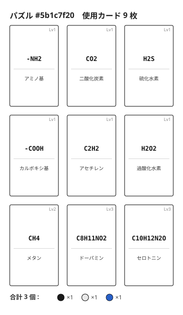
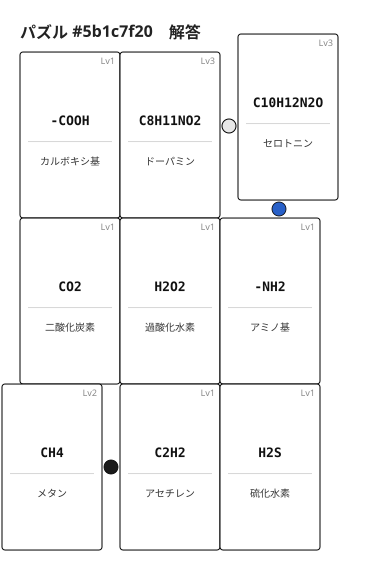

# MolPuzzle（分子パズル）

**日本語** | [English](./puzzle.en.md)

> 🧩 **ぴったり使い切るソロパズル**：9 枚の分子を 3×3 に並べ、隣接同士を元素でつなぐ。余っても不足しても失敗——お題のおはじきをちょうど使い切れれば正解。

お題で指定された9枚の分子構造カードを3×3グリッドに並べ、隣接するカード同士を**共通元素の含有数を比較してつなぐ**ソロパズルです。含有数が一致するペアはカードを辺で接触させ（**接地**・コスト0）、差があるペアはカードを離してその間に差分のおはじきを置きます（**離して配置**）。お題で指定された手持ちのおはじきをぴったり使い切って、**全ての隣接ペアを接続できれば完成**です。

> **おはじきの色は元素を表します**（炭素=黒、水素=白、酸素=赤、窒素=青、その他=黄）。詳しくは [COMPONENTS.md](./COMPONENTS.md) を参照。

- **人数:** 1人（ソロ専用）
- **時間:** 10〜20分/パズル
- **対象:** 12歳以上

> 📘 **おはじきの色とカードの読み方は [COMPONENTS.md](./COMPONENTS.md) を参照**
> 📗 **化学用語（元素・分子式・官能基など）の解説は [GLOSSARY.md](./GLOSSARY.md) を参照**

---

## コンポーネント

- **お題:** [GitHubの `puzzles/` フォルダ（パズルお題集）](https://github.com/moirai2/MolecularStructureOhajiki/tree/main/puzzles) から1問選ぶ
  （お題には「使う9枚の分子構造カード」と「使うおはじきの色・数」が指定されている）
- **分子構造カード9枚:** MolOhajikiセットのカード一式から、お題で指定されたカードを取り出す
- **おはじき:** MolOhajikiセットのおはじきから、お題で指定された色・数を取り出す

---

## 隣接ルール（コアメカニクス）

3×3グリッドに並べたカードは、上下左右で隣接する全てのペア（**全部で12ペア**：横方向3行×2辺=6ペア＋縦方向3列×2辺=6ペア）を元素で接続します（斜めの隣接は対象外）。

> **全12個の隣接ペアを、漏れなく接続しなければなりません。**

例として **練習問題** を見てみましょう。

### お題

**図1. お題画像。** 使う9枚の分子構造カード（過酸化水素・カルボキシ基・硫化水素・アセチレン・ドーパミン・セロトニン・アミノ基・メタン・二酸化炭素）と、使うおはじきの色・数（炭素 C×1、水素 H×1、窒素 N×1、合計3個）が指定されます。

### 解答

**図2. 解答例。** 隣接する2枚で選んだ元素の含有数が一致するペアは**接地**（コスト0、間に何も置かない）、異なるペアは差分のおはじきを間に置いて**離して**配置。手持ちのおはじき3個をちょうど使い切れば完成です。

### つなぎ方

隣接する2枚のカードに対して、**1種類の元素だけ**を選んで接続します。
選んだ元素の**含有数**（その分子に含まれる原子の個数）が一致するか異なるかで、**カードの物理的な置き方**が変わります。

> **重要**: 1つの隣接ペアに使える元素は**1種類のみ**。複数の元素を組み合わせて差を調整することはできません。

| 条件 | カードの置き方 | コスト |
|------|--------------|-------|
| 選んだ元素の含有数が両カードで**一致** | カード同士を**接地**（辺を接触させて配置） | 0個（無料） |
| 選んだ元素の含有数が**異なる** | カードを**離して配置**し、間に差分のおはじきを並べて置く | 差の個数分のそのおはじきを間に置く |

> **接地とは**: カード同士の**辺が物理的に接触**している状態。角だけが触れている状態は接地として扱いません（辺接触のみ有効）。

> **「離して配置」の物理配置は自由**。ただし**3×3の隣接関係は維持**してください。

> **制約**: 接続に使える元素は**両カードに共通して含まれるもののみ**（片方にしかない元素は使用不可）。

### 接続例（パズル #001 のカードから）

| カード① | カード② | 使用元素 | 置き方 | コスト |
|--------|--------|---------|--------|-------|
| TNT (O:6) | グルコース (O:6) | O（両方6） | 接地 | 0個（無料） |
| ヒドロキシ基 (O:1) | 乳酸 (O:3) | O（1と3の差） | 離して酸素おはじき（赤）2個 | 2個 |
| 硫化水素 (H:2) | TNT (H:5) | H（2と5の差） | 離して水素おはじき（白）3個 | 3個 |
| メチル基 (C:1) | グアニジン (C:1) | C（両方1） | 接地 | 0個（無料） |

接続に使う元素はプレイヤーが自由に選択できます。**ただしこれはコスト最小化を目指す問題ではありません**——あえて高コスト接続を組み込まないと指定数をちょうど使い切れない問題もあります。

---

## ゲームの流れ

1. お題を確認し、指定の9枚のカードとおはじきを用意する
2. 9枚のカードを3×3グリッドに任意の順番で配置する
3. 隣接する全てのペアに対して元素を選ぶ
   - 含有数が一致するペア → カード同士を**接地**（辺を接触させる）（コスト0）
   - 含有数が異なるペア → カードを**離して**配置し、間に差分のおはじきを並べて置く
4. 手持ちのおはじきをぴったり使い切って隣接する全てのペアを接続できれば**完成**

カードの並べ替えは何回でも自由。途中で何度でも組み替えてよい。接地と離して配置の切り替えやおはじきの置き直しもいつでも可能です。

### 失敗条件

- どこかのペアを接続するために必要なおはじきが手持ちで足りない場合
- 隣接する全てのペアを接続しても**おはじきが余ってしまう場合**（指定されたおはじき数をちょうど使い切れていない）

→ カードの配置を変えて再挑戦してください。

---

## パズルお題

→ **[パズルお題集を見る](../puzzles/puzzles.md)**

お題は随時追加予定。一覧はおはじき使用数（少ない順）で並んでいます。**はじめての方は上から順に挑戦するのがおすすめです**（おはじきの数が少なくても、最小コストを狙うだけでは解けない問題もあります）。

---

## ハウスルール歓迎

どこを変えても自由です。アイデアはXで `#MolOhajiki` を付けて教えてください。

---

[← ゲーム一覧に戻る](../README.md#ゲーム一覧)
