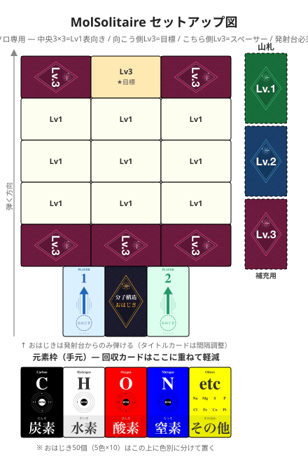

# MolSolitaire (Molecule Solitaire)

[日本語](./solitaire.md) | **English**

> 🎴 **Solo engine-builder with finite resources.** Marbles you flick don't come back. Stack reductions through your element slots and capture the Lv3 target with the fewest marbles spent.

A solo engine-building game: flick marbles to gather molecule cards, layer reductions through your element slots, and work toward a Lv3 target card. The fewer marbles you use, the higher your score. Resources are finite — marbles that go off the board are gone for good.

- **Players:** 1 (solo)
- **Time:** 15–30 min
- **Age:** 10+

> 📘 **Marble colors and how to read a card → [COMPONENTS.en.md](./COMPONENTS.en.md)**
> 📗 **Chemistry terms → [GLOSSARY.en.md](./GLOSSARY.en.md)**

---

## Components

- Molecule cards (Lv1 × 20, Lv2 × 20, Lv3 × 10)
- Element cards × 5 (Carbon, Hydrogen, Oxygen, Nitrogen, Other)
- Marbles: 5 colors × 10 each (50 total)
- Launcher cards × 2 (the flicking position)
- Title card × 1 (used as a spacer between the launchers)
- **Non-slip mat × 1** (keeps cards from sliding around — **required** for play)

---

## Setup

See the diagram for placement ([larger view](./solitaire_setup.svg)).



0. Lay the **non-slip mat** in your play area. It's required so cards don't move when struck
1. Place the **5 element cards** in front of you (player side) in a horizontal row. This row is the **"element slots"** — captured molecule cards go here later to reduce element costs
2. Shuffle the **Lv1 deck**, then place 9 cards face-up in landscape orientation in a **3×3 grid**
3. Place **3 Lv3 cards** along the **far side** of the 3×3 grid (the side away from you)
   - The center card is **face-up** — this is the target you're aiming for
   - The 2 cards to its left and right are **face-down** (spacers)
4. Place **3 more Lv3 cards (all face-down)** along the **near side** of the 3×3 grid (spacers)
5. Place the **2 launcher cards** in portrait orientation along the front edge, with the **title card** between them as a spacer (it widens the launch area). Marbles can only be flicked from one of the launcher cards
6. Stack the **remaining Lv1, Lv2, and Lv3 cards** in level decks beside the play area. **The 4 unused Lv3 cards stay as a deck rather than being removed** (you can use them in your own variants)
7. Place **all 50 marbles (5 colors × 10)** in front of you, sorted by color on top of the element cards

---

## Terminology

**On the board / off the board:**
> The **board** means the 3×3 grid of capture-target cards (Lv1 / Lv2 / the face-up target Lv3). The Lv3 spacer cards (face-down) are **outside the board**.
>
> When a marble comes to rest: **not touching the mat = on the board** (on some card); **touching the mat = off the board**. Because spacers also lift marbles off the mat, the mat test works cleanly — "not touching the mat" always means on some card. Marbles landing on spacers are handled by step 2 of the turn flow (→ discard pile), so no additional ruling is needed. Check by looking from the side.
> A marble straddling multiple cards counts as **on all touched cards** (skilled players can do this intentionally).

**Straddling marbles are "fixed at capture time" (quantum mechanics model):**
> A straddling marble is **not assigned to a specific card in advance**. At the moment you decide "I'm capturing this card" during the capture check, it's locked in as belonging to that card.
>
> **When a card is captured, every marble touching it (including straddlers) goes to the discard pile.**
> Physically lifting a card off the board inevitably moves the marbles on top of it, so straddlers go too.
>
> Consequences:
> - Whichever card you capture first "takes" the straddling marble
> - Any other card you tried to capture loses that marble's contribution
> - **You can't satisfy 2+ cards' capture conditions with a single straddling marble** (physics enforces this)
>
> The order of capture is a strategic choice: A first or B first — which one feeds the chain better?

---

## Turn flow

Solo means you just repeat your own turn. Each turn:

```
1. Flick 1 marble from your hand, from a launcher card.

2. Check where it landed:
   - **Capture-target card** (Lv1 / Lv2 / face-up target Lv3) → marble stays on it
   - **Face-down Lv3 (spacer) only** → **player's choice**:
     - **Treat as off-board** (send to discard pile immediately)
     - **Leave on the spacer** (on a future turn, flick another marble to knock it back onto the grid; if it lands on a capture-target card it counts as on the board)
     > ★ A marble on the near spacer isn't dead yet. Deciding whether to rescue it or cut your losses is part of the skill.
   - **Off-board** (touching no card) → marble goes to the discard pile
   - **Straddling a capture target AND a spacer:** counts as on the capture
     target only (spacer contact is ignored). Skilled players can graze
     spacers to reach the target.

3. Capture check:
   - You may decompose owned cards before checking
     (**decompose** = discard 1 card from your hand to immediately
     reduce this turn's check by that card's element counts.
     Details in the [decomposition section](#decomposition-discard-a-card-for-an-immediate-bulk-reduction)).
   - **In each cycle of chain capture (step 4), you may declare additional decompositions before the next check begins.**
   - For each card on the board with at least 1 marble on it,
     check whether marbles on the card + element-slot reductions +
     decompositions satisfy the requirement. Capture any that qualify.
     **(This includes all marbles on the card — not just the one you just flicked,
     but also any from previous turns still resting there.)**
   - **At the moment of capture, every marble touching the captured
     card (including straddlers) goes to the discard pile.**
     Straddlers are locked in at capture, so they can't contribute to
     any other card's check.
   - You choose the capture order (A→B vs. B→A may give different results).

4. Reorganize your element slots:
   - Place / swap captured cards into the slots
   - If a slot is full, you may take a card out of it back into your hand (stock)
   - **★ Chain captures:** changes to element-slot placement can change
     reductions, which may newly satisfy another card on the board that
     already has marbles on it. Capture that one too in the same turn.
     **Keep chaining until no more cards newly qualify**
     (capture → reorganize → re-check → loop).

5. Refill empty grid slots:
   - For each empty slot, **pick one card** from the Lv1 or Lv2 deck and
     place it face-up (you choose; refills aren't automatic).
   - **The Lv3 deck is not used for refills** (standard rule).

6. End turn.
```
---

## Capture check (core mechanic)

For **every card on the board with 1+ marble on it**, compute the following **for each element**:

```
required = atom count of that element in the card's formula
provided = (marbles of that color touching the card)
         + (count of that element in the card placed in that element slot)
         + (count of that element in any cards you decompose this turn)

For every element in the formula, required ≤ provided → capture succeeds
```

> Note: Straddling marbles count as "on all touched cards" during the check (quantum superposition). **At the moment of capture they collapse onto the captured card and move to the discard pile**, so they can't contribute to any other card's check (see [On the board / off the board](#on-the-board--off-the-board)).

### Capture examples (no reductions or decompositions)

Just looking at marbles physically on the card.

| Card | Marbles on card | Result |
|------|-----------------|--------|
| Water H₂O (H=2, O=1) | White × 2, red × 1 | ✅ Captured (H and O both met) |
| Water H₂O (H=2, O=1) | White × 3, red × 0 | ❌ O=0, not met |
| Water H₂O (H=2, O=1) | White × 2, red × 1, black × 1 (unused color) | ✅ Captured (black is ignored but doesn't block) |
| Methane CH₄ (C=1, H=4) | Black × 1, white × 4 | ✅ Captured |
| Methane CH₄ (C=1, H=4) | Black × 1, white × 3 | ❌ H short by 1 |

> Marbles of unneeded colors on a card don't block capture. On a successful capture, every marble on the card goes to the discard pile.

---

## Element-slot reductions

When you capture a card, you can **place it under one of the 5 element cards (player side)** to permanently reduce that element's cost. The element cards stay in place as marble holders; the captured card slides in beside / underneath them. The reduction equals the captured card's count of that element, applied to **every** future capture check.

**Rules:**
- Each element slot holds **at most 1** card (max 5 total across the row)
- Reduction value = the placed card's count of that element
- Placing / swapping happens during **step 4** of the turn flow ([Turn flow](#turn-flow))
- **A card removed from a slot during a swap goes back to your hand (stock)** — it can still be used for decomposition later

| Example placement | Effect |
|-------------------|--------|
| H₂O in **oxygen slot** | O reduction = 1 |
| CH₄ in **hydrogen slot** | H reduction = 4 |
| Glucose C₆H₁₂O₆ in **hydrogen slot** | H reduction = 12 |

**Using a reduction:**
With H₂O in the oxygen slot (O reduction = 1), target Ethanol C₂H₆O (C=2, H=6, O=1):
- C: need 2 → black × 2 on the card (no reduction)
- H: need 6 → white × 6 on the card (no reduction)
- O: need 1 → **slot reduces by 1, requirement met automatically.** No red marble needed on the card

> The more cards you collect, the more your reductions stack, and bigger molecules become reachable.

---

## Decomposition (discard a card for an immediate bulk reduction)

**Discard** a captured card from your hand (stock), and the count of **1 chosen element** in that card immediately reduces this turn's capture check by that amount.

**Procedure:**
1. Declare which card you're decomposing and which **single element** you're using
2. Send that card to the **discard pile** (cannot be reused)
3. The chosen element's count from that card is subtracted from this turn's requirements

**Important:**
- Only **1 element** can be picked per decomposed card (even if the card has multiple)
- You can decompose cards from your **hand (stock)** or from your **element slots** — for slot cards, remove from the slot to the discard pile (you lose the reduction)
- **You cannot use the same card for both reduction and decomposition in the same turn.** Once a card leaves the slot, only decomposition applies.
- You can decompose **multiple cards** in the same turn

### Decomposition example

Trying to capture Ethanol C₂H₆O (C=2, H=6, O=1), adding hydrogen via decomposition:

| Card decomposed | Element chosen | H added |
|-----------------|----------------|---------|
| H₂O decomposed | Hydrogen | +2 |
| Methyl (-CH₃) decomposed | Hydrogen | +3 |
| **Total (declared together)** | | **+5** |

With just 1 white marble on the card, H need (6) ≤ provided (1+5)=6 → hydrogen requirement satisfied.

---

## Deadlock (loss)

You lose the game once:

- **You have 0 marbles in hand**, AND
- **Even decomposing every owned card, no grid card can be captured**

The more off-board mistakes you make, the higher your deadlock risk. **Marble economy is the heart of this game.**

---

## Winning and scoring

**You win the game the moment you capture the target Lv3 card (the face-up card on the far side).**

At game end, count how many marbles you've used:

```
Marbles used = 50 − marbles remaining in hand
```

**Lower = higher score.**

---

## Designer's notes

### Why are 6 Lv3 cards placed on the board?

The non-slip mat is necessary to anchor the cards — but it also **stops marbles**. When a marble misses a capture-target card and stops on the mat, it can end up barely grazing an adjacent card, causing an unintended capture check.

The fix: surround the target Lv3 (1 face-up) with **6 Lv3 cards placed on the board (1 face-up target + 5 face-down spacers)**. Stray marbles that land on a spacer go straight to the discard pile, eliminating accidental triggers. The 5 face-down spacers act as a "safety net" — together with the face-up target Lv3, that's 6 Lv3 cards placed on the board.

---

## House Rules Welcome

Grid size, target card level, decomposition limits… feel free to change anything.

**Share your custom rules on X with `#MolSolitaire` — we'd love to hear them.**

---

[← Back to game list](../README.en.md#the-five-games)
