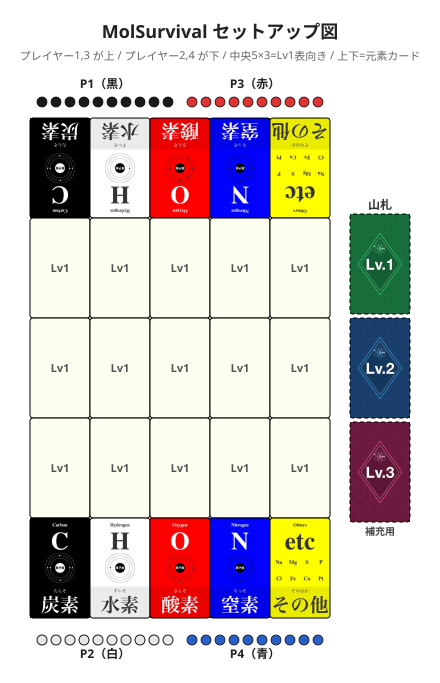

# MolSurvival（元素サバイバル）

**日本語** | [English](./survival.en.md)

> 🎉 **カオス系パーティサバイバル**：同時発射で運も実力も巻き込んで誰かが必ずおはじきを失う。理不尽さを笑いながら楽しむ早回しゲームです。

おはじきを10個持ってスタート。弾いたおはじきが手元に戻らなかった分だけ減っていく。
0個になったら脱落。最後まで生き残ったプレイヤーの**勝ち**。

- **人数:** 3〜4人推奨（2〜5人でも可。5人時はおはじき5色全てを使い切る）
- **時間:** 10〜20分
- **対象:** 6歳以上（小さい子向けには [バリアント①「炭素カウントモード」](#バリアント-炭素カウントモード子供向け) で簡略化可）

> 📘 **おはじきの色とカードの読み方は [COMPONENTS.md](./COMPONENTS.md) を参照**
> 📗 **化学用語（元素・分子式・官能基など）の解説は [GLOSSARY.md](./GLOSSARY.md) を参照**

---

## セットアップ

1. **おはじき**: 各プレイヤーは黒・白・赤・青・黄から好きな1色を選び、その色のおはじきを10個ずつ手元に置く（プレイヤー間で同じ色は使えない）

2. **中央グリッド**: Lv1カードをシャッフルし、**15枚を5×3グリッドに表向きで配置**する（残り5枚はLv1山札へ）。これが「盤」になります

3. **元素カード**: 元素カード10枚を、グリッドの**上下に5枚ずつ**配置する（炭素・水素・酸素・窒素・その他、並び順は自由）。**上側の5枚は180°回転させて、漢字（炭素・水素・酸素・窒素・その他）が上側プレイヤーから見て手前に来るようにする**。これがプレイヤーの**発射エリア**です（盤面ではなく境界外）

4. **補充用山札**: 残りのカードをレベル別の山札として盤の脇（左右どちらでも）にまとめて積む
   - **Lv1山札**: 残り5枚
   - **Lv2山札**: 全20枚
   - **Lv3山札**: 全10枚

5. **座り方**: プレイヤーは盤の上下どちらかに自由に座る（隣同士・向かい合いどちらでもOK）。各プレイヤーは自分側の元素カード上の**漢字（炭素・水素・酸素・窒素・その他）が書かれた手前側**におはじきを置いて弾きます（カード上は滑るので発射しやすい）。**通常プレイでは発射台カードは使用しません**（ハンディキャップ専用、[詳細](#距離ハンデ)）

   - **2人**: 上下に 1 人ずつ向かい合い
   - **3人**: 上 2 / 下 1 または 上 1 / 下 2
   - **4人**: 上下に 2 人ずつ（標準・図の例）
   - **5人**: 上下を 3 / 2 に分ける（密になるので肘がぶつからない座席を確保）。**5人プレイは盤面が混み合うため競合・盤外が起こりやすく、よりパーティ寄りのカオス展開になります**

下図は4人プレイ時のセットアップ例です（[拡大図](./survival_setup.svg)）。

---

## 1ラウンドの流れ

### ① 弾きフェーズ

全プレイヤーが**同時に**おはじきを弾く。

- 誰かが「**3、2、1、発射!**」を唱える
- 「発射!」のタイミングで、全員が同時に**自分側の元素カードの漢字が書かれた手前側**から1個ずつ弾く
- **着地判定:** おはじきが**少しでも分子構造カード（中央5×3グリッド）に乗っていれば着地成功**。分子構造カードに触れていない場合（元素カード上または机に止まる）は「**盤外**」扱い
- **複数の分子構造カードにまたがった場合（量子力学モデル）:** 物理的に複数のカードに触れている場合、**触れているカードすべてに乗っている**扱いになる（上手い人はあえてまたがるよう狙うこともできる。②競合の回避や③最多元素の回避に使える）。どのカードに割り当てるかは事前には決まっておらず、**生存判定の瞬間にプレイヤーが1枚を選んで着地カードを確定**する（=観測で初めて決まる）。**小さなお子さんとプレイする場合は「最も多く乗っているカード」を着地カードとする裁定にすると揉めにくい**

### ② 生存判定フェーズ

以下の3つの判定を **①→②→③ の順に確認**し、**いずれかが該当した時点でラウンド終了**。後のフェーズは判定されません。該当したプレイヤーがおはじきを失い、**他全員は弾いたおはじきを手元に戻します**。

| 順 | フェーズ | 該当条件 | 処理 |
|---|---------|---------|------|
| ① | **盤外** | 中央グリッド外（元素カード上または机上）に出したプレイヤーが**1人でもいる** | 盤外プレイヤー全員がおはじき1個失う。**他全員は手元に戻す**。判定終了 |
| ② | **競合** | ①該当者なし、かつ同じ分子構造カードに2人以上が着地している | 競合カードに乗ったプレイヤー全員がおはじき1個失う。**他全員は手元に戻す**。判定終了 |
| ③ | **最多元素** | ①②該当者なし（全員別々の分子構造カードに着地） | **着地した分子構造カードの中で**元素合計（total）が最大のカードに乗ったプレイヤーがおはじき1個失う（同数最多は該当者全員） |

> ⚠️ **1ラウンドで発動するフェーズは1つだけ**
> 盤外があれば②③は判定しない。盤外がなく競合があれば③は判定しない。**安心して大胆に弾けます。**

> **元素合計（total）とは？**
> カードに含まれる元素の個数の合計。
> 例: H₂O は total=3（H 2個 + O 1個）、CH₄ は total=5、C₂H₂ は total=4、C₆H₁₂O₆（グルコース）は total=24。
> 化学用語の詳細は [GLOSSARY.md](./GLOSSARY.md) を参照。

> **判定例**（4人プレイ）
> - **例1（盤外発動 → ①で終了）**: Aが盤外、BCがH₂Oに着地、DがCH₄に着地
>   - ① Aが盤外 → **A だけ1個失う**。BCD はおはじきが手元に戻る（②③は判定しない）
> - **例2（競合発動 → ②で終了）**: 盤外なし。ABがH₂Oに着地、Cが C₆H₆、Dが CH₄
>   - ①該当なし、② ABがH₂Oで競合 → **AB だけ1個失う**。CD はおはじきが手元に戻る（③は判定しない）
> - **例3（最多元素のみ → ③発動）**: 全員違う分子構造カードに着地、最大totalがC₆H₆（total=12）でAが乗っている
>   - ①②該当なし、③で A が最多 → **Aだけ1個失う**
> - **例4（同数最多 → ③発動）**: 4人全員違う分子構造カードで全て同じtotal
>   - ①②該当なし、③で全員が同数最多 → **全員1個失う**

おはじきが**0個になったプレイヤーは脱落**しますが、希望すれば [「おじゃま参加」モード](#脱落者のおじゃま参加モード) で続けて弾けます。

### ③ 除去・補充フェーズ

> 🔥 **重要ルール：着地があった分子構造カードは、誰が生存したかに関係なく全て捨てられる。**
> 安全に着地できたカードも、競合・最多判定で失ったカードも、ラウンド終了時に全て **捨て場** に置かれる（山札には戻さない）。元素カード（発射エリア）は消費されません。これにより、安全な低 total カードが消えていき、Lv2/Lv3 が補充されて盤面が徐々に危険化する——これがこのゲームの本質です。

空いたマスは、**Lv1山札がある間はLv1から**補充する。Lv1が尽きたらLv2、Lv2が尽きたらLv3を補充する（マスごとの個別判定ではなく、山札単位で順に消費する）。

---

## ゲーム終了

以下のいずれかで終了する。

| 条件 | 処理 |
|------|------|
| 残り1人になった | そのプレイヤーの勝ち |
| 全山札がなくなった | 手元のおはじきが最も多いプレイヤーの勝ち（同数は引き分け） |

---

## 脱落者の「おじゃま参加」モード

おはじきが0個になり本編から脱落したプレイヤーも、希望すれば続けて弾き続けて遊べます。

- **元の自分の色**のおはじきを1〜2個ストックから借りる（脱落済みなのは全員わかっているので色を変える必要はない）
- 本編プレイヤーと同じタイミング（「3、2、1、発射!」）で弾く
- **脱落者の弾きは生存判定で完全に無視**: 着地しても競合や最多判定の対象外、盤外に出てもおはじきは手元に戻る（脱落者にはペナルティが発生しない）
- 脱落者のおはじきが盤上に乗った場合は、判定後に取り除いて返却
- 物理的に本編プレイヤーのおはじきに当たって動かしてしまっても、本編プレイヤーは **「おじゃま」として笑って許容** する（やり直しなし）

> 観戦より参加した方が楽しい救済モード。盤外狙いの妨害弾きも、自分の練習も自由。気が向いたら好きなだけ参加できます。

---

## 戦略ヒント

- 元素合計が少ない分子構造カード（H₂、N₂など total=2）を狙うと③最多元素を回避しやすい
- ライバルが狙いそうな高total（Lv3など）のカードに乗ると、競合・最多のどちらかで失うリスクが高い**危険ゾーン**
- **盤外は確実に1個失う**。元素カードに着地するのも盤外扱いなので、力加減を間違えて手前で止まると即ペナルティ。一方、誰かが盤外を出すと**それ以降の判定はスキップ**されるので、他のプレイヤーは全員安全（盤外は「みんなの身代わり」になる側面もある）
- Lv2・Lv3カードが補充される後半戦は元素合計が急増する。終盤は「最も低totalのカード」を取り合う展開になりやすい（取り合えば②競合、避ければ③最多）

---

## バリアント

以下のバリアントをプレイ前に全員で選択する。

### バリアント①: 炭素カウントモード（子供向け）

「元素合計（total）」の計算が難しい子供向けに、**炭素（C）の数だけ**で最多判定する簡易ルール。

- ① 盤外、② 競合は通常通り
- ③ 最多元素 → **着地したカードの中で、炭素（C）の数が最大のカードに乗ったプレイヤーが失う**（同数最大は該当者全員）
- **全員が同じ炭素数（全員C=0を含む）の場合 → 全員が同数最大として全員失う**（「全員でカオス回避」は不可。これがカオス感の肝）

→ 数えるのは「黒（炭素）のおはじきの数」だけ。**対象年齢: 6歳以上**。

### バリアント②: ターン制モード（戦略重視）

スタートプレイヤーから時計回りに、各プレイヤーが順に1回おはじきを弾く。後手は前のプレイヤーの着地点を見てから狙えるため有利。

- 自分のおはじきで他プレイヤーのおはじきに当てて**場の中で動かす**のは自由（攻撃戦略）
- **他プレイヤーのおはじきを盤外に押し出してしまった場合:** **押し出した本人**がおはじきを1個失う。被害者と他全員は無傷。ラウンドはそこで終了（通常の ①②③ カスケード判定は行わない）
  - **複数人のおはじきを同時に盤外に押し出しても、失うのは1個だけ**（押し出した本人のペナルティは累積しない）
  - **自分のおはじきも一緒に盤外に出た場合も、失うのは1個だけ**（盤外×2扱いにはならない）
  - → 攻撃するなら相手を**場内で動かす**こと。完全に外に出すと自分のペナルティ
  - → 上手な戦略例: 相手のおはじきを低totalカードから高totalカードへ押し出し、③最多のリスクを負わせる
- **誰も他プレイヤーのおはじきを盤外に押し出さなかった場合:** 全員のターン終了後、通常通り ① 盤外 → ② 競合 → ③ 最多 のカスケード判定を行う
- **自分のミスで盤外に出した場合:** 通常通り ① 盤外として、ラウンド終了時の判定でおはじき1個失う
- **スタートプレイヤー交代:** 後から弾くほど有利なため、ラウンドごとに**反時計回り**に1人ずつ交代

→ 攻撃と精密射撃のバランスが鍵。相手を盤外に押し出してしまうと自分が損するため、慎重なコントロールが要求される。**対象年齢: 10歳以上**。

### バリアント③: 目隠しモード（パーティ向け）

弾く瞬間に視界を遮る、笑い狙いのカオスモード。

- 自分の手番が来たら**目を閉じる**（または手のひらを額に当てて視界を遮る）
- そのまま自分側の元素カードから自分のおはじきを弾く（着地点はほぼ運任せ）
- 生存判定は通常通り
- 全員に適用 / 一部のプレイヤーだけに適用（ハンデとして）どちらも可

→ 実力差を一気に縮められるため、年齢差のあるグループや、おはじきが得意な人へのハンデとしても有効。

### バリアント④: チーム戦（4人専用）

2vs2のチーム戦。

- 4人を2チームに分ける
- 各プレイヤーは個別の色のおはじきを使う（計4色）
- 生存判定は通常通り個人ごとに行う
- どちらかのチームの全員が脱落したら終了、残ったチームの勝ち
- チーム内での相談は自由

→ 家族や教室での協力的体験に向く。対象年齢: **10歳以上**。

---

## ハンディキャップルール

実力差のあるプレイヤーが一緒に遊ぶための調整ルール。プレイ前に全員で合意する。

### 距離ハンデ
- 強い側だけ自分側の元素カードの外側に**発射台カードを追加**し、そこから弾く（盤までの距離が長くなり難易度が上がる）

### 利き手ハンデ（最も使いやすい）
- 強い側は**利き手と逆の手**で弾く

### 資源ハンデ
- 強い側の**開始おはじきを7〜8個**にする（少ない命数でスタート）

### 目隠しハンデ
- 強い側だけバリアント③（目隠しモード）を適用する

### 組み合わせ推奨例
| プレイヤー構成 | 推奨ハンデ |
|--------------|----------|
| 大人 vs 6〜8歳 | 利き手ハンデ + 距離ハンデ |
| 大人 vs 9〜12歳 | 利き手ハンデ のみ |
| 経験者 vs 初心者（同年代） | 距離ハンデ または 資源ハンデ |

---

[← ゲーム一覧に戻る](../README.md#ゲーム一覧)
