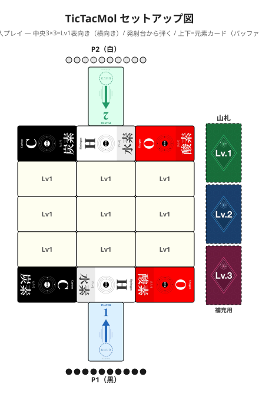

# TicTacMol（三目並べ×分子）

**日本語** | [English](./tictacmol.en.md)

> 🎯 **同時弾きの三目並べ**：おはじきで陣地を取り合い、縦・横・斜め 1 直線を押さえたらカード獲得。獲得すると高得点カードが現れる。

同時におはじきを弾いて、縦・横・斜めに3枚揃えてカードを奪う対戦ゲームです。
揃えるたびに高得点カードが現れ、盤面が進化していきます。相手の今の狙いは読めません——盤上に残ったおはじきの配置から「次」を読んでください。

- **人数:** 2人専用
- **時間:** 15〜25分
- **対象:** 6歳以上（標準・交互弾き）/ 10歳以上（ハードコア）

> 📘 **おはじきの色とカードの読み方は [COMPONENTS.md](./COMPONENTS.md) を参照**
> 📗 **化学用語（元素・分子式・官能基など）の解説は [GLOSSARY.md](./GLOSSARY.md) を参照**

---

## ゲームの準備

1. 2人のプレイヤーは**盤を挟んで向かい合わせ**に座る
2. 各プレイヤーは自分の色のおはじきを10個選び、手元に置く
3. Lv1カードをシャッフルし、9枚を **3×3グリッド** に表向きで配置する（**グリッドは整列させて置く。斜めや重なりがあると判定しにくくなります**）
4. グリッドの**上下に元素カード3枚（炭素・水素・酸素）ずつ**を**横向き**で並べる（3枚の幅がグリッドと揃う。上下それぞれのプレイヤーから読みやすい向きに揃える。**乗っても盤外扱い** ——おはじきを弾く発射エリアであり、着地マスではない）
   > 元素カードは5種ではなく3種（炭素・水素・酸素）を使います。グリッドが3列なので、3枚がちょうど揃う幅になります。
5. **発射台カード 2枚**を、上下の元素カードのさらに外側（プレイヤー側）に1枚ずつ縦向きで配置する。**おはじきは発射台カードの上に置いて弾く**（カード上は滑るので発射しやすい）
6. 残りのLv1カード、Lv2カード、Lv3カードはそれぞれ**裏向きの山札**として盤の脇（右側を推奨）に積む

下図のように配置します（[拡大図](./tictacmol_setup.svg)）。

---

## ゲームの流れ

### 基本概念：「押さえる」

> **「押さえる」= 自分のおはじきがカードに乗っている動的状態。**
> - 押さえているカードが、三列揃い判定の対象になる
> - **押さえは永続ではない**: 自分のおはじきが盤外に出ると、そのカードの押さえを失う
> - **1枚のカードを両プレイヤーが同時に押さえることができる**（共有押さえ）
> - カードを手に取って獲得するのは、三列揃いが完成したときだけ

---

ゲームは**ラウンドの繰り返し**で進行します。1ラウンドの構成:

> 弾く → 着地判定 → 押さえ更新 → 三列揃い判定 → カード獲得・補充

---

### 1. 同時弾き

1. 両プレイヤーはそれぞれ狙うカードを決める（無言推奨）
2. どちらかが「**3、2、1、発射!**」と掛け声をかける
3. 「発射!」で両プレイヤーが**自分の発射台カードの上から**同時に1個ずつ弾く
4. おはじきが**完全に止まる**まで待つ（微妙な場合は全員が納得する位置で判定する）
5. **着地判定**: おはじきが**盤面（3×3の分子構造カード）に乗っていれば盤上**。元素カード上・マット上・テーブル上は全て**盤外**（横から見て判断）

   **おはじきの行き先まとめ**:

   | 状況 | 処理 |
   |------|------|
   | 盤外（着地判定・弾き飛ばし） | オーナーに返却（手元へ） |
   | 獲得カード上 | オーナーに返却（手元へ） |
   | 共有カード上 | オーナーに返却（手元へ） |
   | 盤上に残存 | そのまま（次ラウンドに持ち越し、押さえを継続） |

6. **三列揃い判定**（下記参照）
7. カード獲得・補充

> **注意**: カードがズレた場合は判定前に元の位置に戻してください。

---

### 2. カードを押さえるルール

- 自分のおはじきが**1個でも**乗っているカードを「**押さえている**」と言う
- 押さえている間、そのカードは**自分の三列揃い判定の対象**になる
- **押さえている状態は永続ではない**: 自分のおはじきが弾き飛ばされて盤外に出れば、押さえている状態は失われる

**例**:
- ラウンド1で右上のカードに自分のおはじきを乗せた → 右上を押さえている
- ラウンド2で相手にそのおはじきを弾き飛ばされた → 押さえている状態を失う

**両者が同じカードを押さえる（共有押さえ）**: 1枚のカードを両プレイヤーが同時に押さえることができる。相手のおはじきが同じカードに乗っていても自分の押さえは失われない（おはじきの個数は関係ない）。

**例**: AとBが同じ中央カードにそれぞれのおはじきを乗せている場合、A・B両者が中央を「押さえている」状態になる。どちらも中央を自分の列の1マスとして使える。

#### おはじきが複数のカードにまたがった場合（量子力学モデル）

物理的に複数のカードに触れている場合、**触れているカードすべてを同時に押さえている**扱いになる（上手い人は狙ってまたがらせることもできる）。

> **重要**: またがりおはじきは、**三列揃い判定中は1枚のカードにのみ割り当てられる**。異なる列の判定で別のカードに使い回すことはできない。割り当てたら変更できない。

判定の瞬間にプレイヤーが「このおはじきはどのカードに割り当てるか」を1つ選んで確定する（観測するまでどのカードか決まらない、という意味で量子力学モデルと呼んでいます）。

> **例**: 中央と右のカードにまたがった場合——右を選べば右の列が完成する状況なら右を選べる。中央を選んだほうが有利なら中央を選んでよい。ただし1個のおはじきは1枚分にしか割り当てられないため、縦列のために「中央」と横列のために「右」を同時に選ぶことはできない。

そして**カードを獲得した瞬間、そのカードに触れているおはじき（またがり含む）は全てオーナーに返却される**。

---

### 3. 三列揃い判定

> 🔄 **重要**: 完成判定は両プレイヤー同時に行う。すべての完成ラインを両者まとめて確認した後、カード獲得処理を行う。先に判定した側が有利にはならない。

3×3グリッドの**縦・横・斜めの1直線（3マス分）をすべて自分が押さえていれば**、その3枚を獲得します。

> ⚠️ 「3個のおはじきを同じ列に乗せる」のではなく、「**1直線にあるカード3枚すべてに自分のおはじきが乗っている**」状態です。

**両者同時完成**: 同じラウンドで両者が別々の列を完成させた場合、**両方とも獲得します**（重ならない部分はそれぞれが自分の3枚を獲得）。

**共有カード**: 両者の完成ラインが**同じカード**で重なった場合:

- そのカードは**盤上に残る**（どちらも獲得できない）
- 共有カード上のおはじきは**全てオーナーに返却**される
- 次ラウンドで再び両者が争える（中立地帯としてリセット）

**共有カードの例**: Aが中段横・Bが中央縦を同時に完成させた場合（各マスはそのプレイヤーが押さえているカード、★は両者が押さえる共有カード）

|  | 左列 | 中列 | 右列 |
|:---:|:---:|:---:|:---:|
| 上段 | — | B | — |
| 中段 | A | **★** | A |
| 下段 | — | B | — |

★（中央）は両者の完成ラインが重なる共有カード → 盤上に残る。★上のおはじきは全てオーナーに返却される。
- **A獲得**: 左中段・右中段の2枚
- **B獲得**: 中上段・中下段の2枚

**複数列の同時獲得（1個で複数列を完成）:**

1個のおはじきが2列や3列の交点に当たり、自分が他の列を既に押さえていた場合、複数列を同時完成できる。

| 完成した列 | 獲得枚数 | 例 |
|----------|--------|------|
| 1列 | 3枚 | 横1列を完成 |
| 2列（交点1枚共有） | 5枚 | 横+縦 / 横+斜め（例：中央が交点） |
| 3列（交点1枚共有） | 7枚（実質最大） | 縦+横+斜め1 全てが中央を通る |

**例**: 既に**対角の2隅（左上・右下）と上下左右の4辺（計6枚）**を押さえている状態で、最後に**中央**のカードを押さえると、縦1列・横1列・斜め1列の3列が同時完成し、**7枚獲得**できる（中央のカードは全列で共有なので1枚としてカウント）。

---

### 4. カード獲得と補充

1. 獲得が確定したカードを手元に置く
2. 獲得したカード上に乗っているおはじき（敵味方問わず）を全てそれぞれのオーナーに返却する
3. 空いたマスは、**Lv1山札がある間はLv1から**補充する。Lv1が尽きたらLv2、Lv2が尽きたらLv3を補充する

---

### 5. 妨害戦略

**① 物理妨害**: 前のラウンドで盤上に残った相手のおはじきを弾き飛ばす。盤外に出たおはじきはオーナーに返却され、相手はそのカードの押さえを失う。

**② 列完成による妨害**: 相手が狙っている列と交差する列を完成させ、獲得処理（手順4）で相手のおはじきも盤外に出して陣形を崩す。
- 自分のみ列完成 → 獲得カード上の相手のおはじきも返却 → 相手の押さえが消える
- 両者が交差する列を同時完成 → 共有カードは残り、両者の押さえもそこだけリセット

得点の低いLv1カードをあえて完成させて相手の陣形を崩す、捨て身の戦略も生まれます。

---

## ゲームの終了

### 終了条件

**ラウンド処理（獲得・補充）の結果、3つの山札（Lv1・Lv2・Lv3）すべてが空になり、それ以上補充できなくなった時点でゲーム終了**します。

- そのラウンドの判定・獲得・可能な範囲での補充までは通常通り処理します
- **盤上に残っているカード（最大9枚）は得点に含まれません**
- 終盤、山札の残りが少なくなったら、低レベルカードの獲得で終了を早めるか、Lv3を引き出す布石にするかが戦略の分かれ目です

### 得点計算

獲得カードの **fg pt（官能基ポイント）の合計**が得点。最高得点が勝利。各カードのfg ptは右上に表記されています（読み方は [GLOSSARY.md](./GLOSSARY.md) を参照）。

| レベル | 得点範囲 | 特徴 |
|--------|--------|------|
| Lv1 | ほぼ0点 | 序盤の陣地取り・盤面進化のトリガー |
| Lv2 | 0〜4点 | 中盤から点差がつく |
| Lv3 | 2〜6点 | 終盤の高価値カードを巡って激戦 |

---

## 戦略ヒント

- **Lv1は意図的に揃えて盤面を進化させる**: 得点は低いが、Lv2・Lv3カードを呼び込む布石になる
- **残留おはじきから相手の狙いを読む**: 今のラウンドの発射先は分からないが、過去の残留から予測できる
- **「ダブル」「トリプル」が最大の逆転要素**: 一手で2〜3列同時完成できる位置に狙いを絞る
- **共有カードのリスクを読む**: 相手と同じカードを同時に狙うと両方が損をする——ここに読み合いが生まれる

---

## FAQ

**Q: どのカードに乗ってもそのカードを押さえられますか？**
A: はい。おはじきの色に関係なく、**盤面（3×3グリッド）内の分子構造カード（Lv1/Lv2/Lv3問わず）に乗っていれば**そのカードを押さえている状態になります。元素カードに乗った場合は盤外扱いで押さえになりません。

**Q: おはじきが複数のカードにまたがった場合はどうなりますか？**
A: 触れているカードすべてを押さえている扱いになります（複数押さえ）。どのカードに割り当てるかは判定の瞬間まで決まらず、プレイヤーが有利になるように1枚を選びます（量子力学モデル）。**1個のおはじきは判定中に1枚のカードにしか割り当てられない**ので、2個のおはじきで3枚揃えることはできません。

**Q: 両者が同じラウンドで列を完成させた場合、共有カードはどうなりますか？**
A: 共有カードは盤上に残り、そのカードを除いた獲得確定カードを手元に置きます。共有カード上のおはじきは全て各オーナーに返却されます（次ラウンドで再び争える）。

**Q: カードが動いてしまったら？**
A: おはじきが完全に止まる前にカードがズレた場合は、判定前に元の位置に戻してください。判定後に動いた場合はそのままにします。

**Q: 盤外のおはじきはいつ戻しますか？**
A: おはじきが完全に止まった後、手元に戻します。

---

# 上級ルール

## バリアント一覧

ゲーム開始前に以下の項目から選択してください。組み合わせは自由です。

### 1. 弾き方

| 選択肢 | 説明 | 推奨 |
|--------|------|------|
| **同時弾き** | 「3、2、1、発射!」で同時に弾く | 標準（6歳〜） |
| 交互弾き | 交互に1手番ずつ弾く | 年少児・戦略派（6歳〜） |
| ダブル弾き | 弾き飛ばされたら次のラウンドで2個同時に弾ける | 上級者 |

### 2. カード枚数

| 選択肢 | 説明 | 推奨 |
|--------|------|------|
| **全レベル** | Lv1〜Lv3（50枚）使用 | 標準 |
| Lv1・Lv2のみ | Lv3なし | 短時間プレイ |

### 3. おはじきの返却

| 選択肢 | 説明 | 推奨 |
|--------|------|------|
| **通常返却** | 獲得カード上の相手おはじきをオーナーに返す | 標準 |
| ハードコア | 獲得カード上の相手おはじきをゲームから除外 | 大人向け |

### おすすめ組み合わせ

| 対象 | 弾き方 | おはじき返却 | カード |
|------|--------|------------|-------|
| **年少児向け（6歳〜）** | 交互弾き | 通常返却 | 全レベル |
| **標準（6歳〜）** | 同時弾き | 通常返却 | 全レベル |
| **上級者** | 同時弾き + ダブル弾き | ハードコア | 全レベル |

---

## 交互弾きバリアント

> 同時弾きの緊張を取り除き、戦略とデクステリティに集中できるモードです。

- ジャンケンで先手を決定し、ラウンドごとに先手を交代
- 「3、2、1、発射!」の掛け声は不要。自分の手番でゆっくり狙いを定めてよい
- 三列揃い判定・カード獲得・補充は同じ
- 同時に弾かないため共有カードはほぼ発生しない
- 物理妨害（押し出し）が通常より重要になる

6歳以上から遊べる。手がぶつかるのが苦手な場合にも向く。

---

## ハードコアバリアント

> **通常ルールより攻撃性が大きく上がります。** 限られた資源をいかに守るか、読み合いと駆け引きが濃くなる大人向けモードです。

通常ルールでは返却される相手のおはじきを**永久排除**にする。

- 列完成で獲得したカード上の相手おはじき → **ゲームから除外**（オーナーに戻らない）
- おはじきは10個のみ。**一方が枯渇した時点でゲーム終了**（その時点の得点で勝敗）

10歳以上推奨。

---

## ダブル弾きバリアント

> 弾き飛ばされたら次のラウンドで2個同時に弾けるリベンジルールです。

**発動条件**: 相手のおはじきが自分のおはじきに当たり盤外に飛び出した場合のみ
（自分のミスや盤内に残った場合は不発動）

**処理**:
1. 飛び出したおはじきを手元に置いておく
2. 次のラウンド、そのおはじきと手元の別のおはじき1個を**両手同時に弾く**
3. 掛け声は「**いっせいのせい！**」
4. 2個それぞれの着地・押さえを通常通り判定
5. 三列揃い判定も通常通り。**1ラウンドで2個分の押さえ更新が一度に発生**するため、ダブル/トリプル完成のチャンスが大きく上がる

| 状況 | 処理 |
|------|------|
| 2個のうち片方が盤外 | 盤外の1個はオーナーに返却。盤上の1個は通常通り押さえ・判定 |
| 複数飛び出した場合 | 2個が上限。余分は通常返却 |
| 互いに弾き飛ばし合った場合 | 「痛み分け」——両方とも通常返却 |
| 3枚完成の巻き込みで盤外になった場合 | 通常返却（このルール不適用） |
| 相手もダブル弾き権利を持っている場合 | 両者とも2個ずつ弾く（合計4個が同時に発射される） |

利き手でない方は狙いが甘くなるため、2個弾けることが必ずしもチャンスになるわけではない。決まった場合は「お見事！」と称えよう。

---

## ハンディキャップルール

実力差のあるプレイヤーへの調整ルール。プレイ前に全員で合意する。

| ハンデ | 内容 |
|--------|------|
| 距離ハンデ | 強い側の発射台カードを盤からさらに10〜20cm離して配置する（または斜め配置）。元素カードとの間に隙間ができて距離が伸びる |
| 利き手ハンデ | 強い側は逆の手で弾く（最もシンプルで効果的） |
| 資源ハンデ | ハードコア時、強い側の初期おはじきを10→7個に減らす（先に枯渇した側の負け。7個スタートの側が先に枯渇しやすいのがハンデの効果） |
| 目隠しハンデ | 強い側だけ目を閉じて弾く |
| 命中ペナルティ | 強い側が命中した場合に1点減点または相手に1点贈与 |

**推奨組み合わせ**:

| 構成 | 推奨ハンデ |
|------|---------|
| 大人 vs 6〜8歳 | 利き手ハンデ + 距離ハンデ |
| 大人 vs 9〜12歳 | 利き手ハンデのみ |
| 経験者 vs 初心者 | 距離ハンデ または 資源ハンデ |

---

## ハウスルール歓迎

どこを変えても自由です。アイデアはXで `#MolOhajiki` を付けて教えてください。

---

[← ゲーム一覧に戻る](../README.md#ゲーム一覧)
